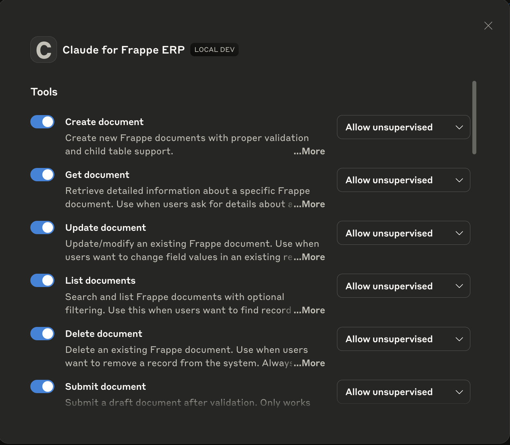
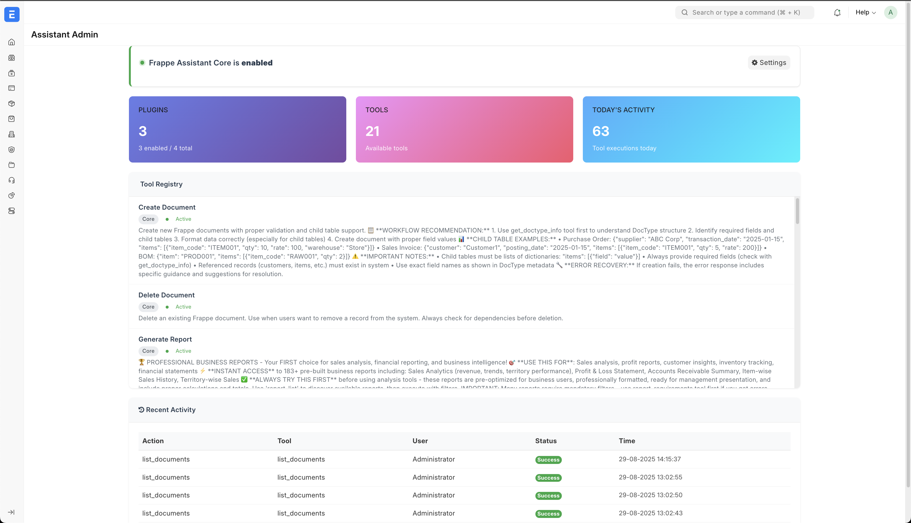
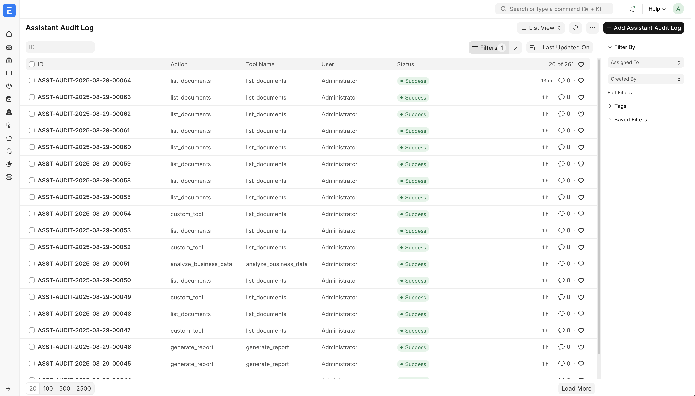
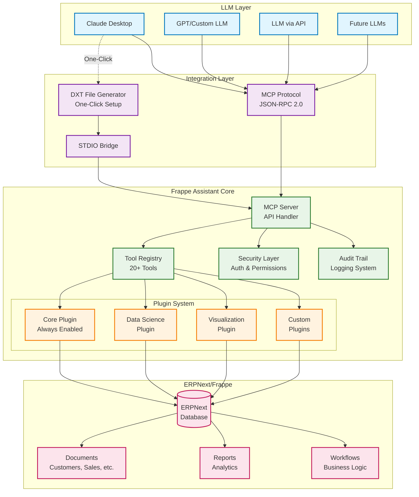
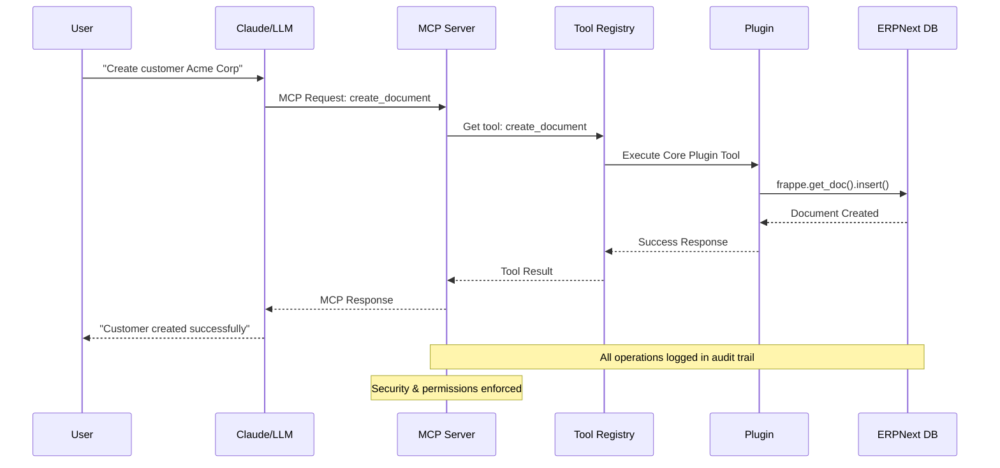
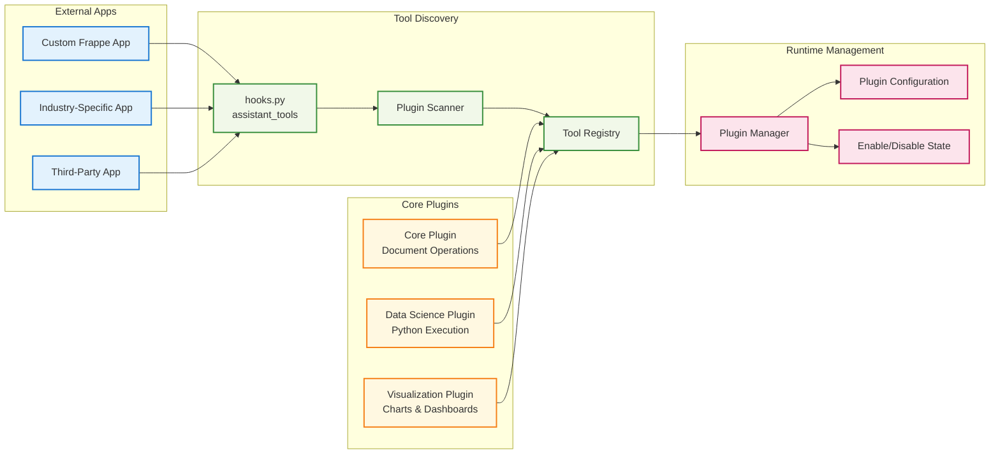
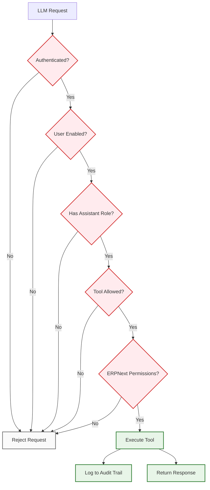
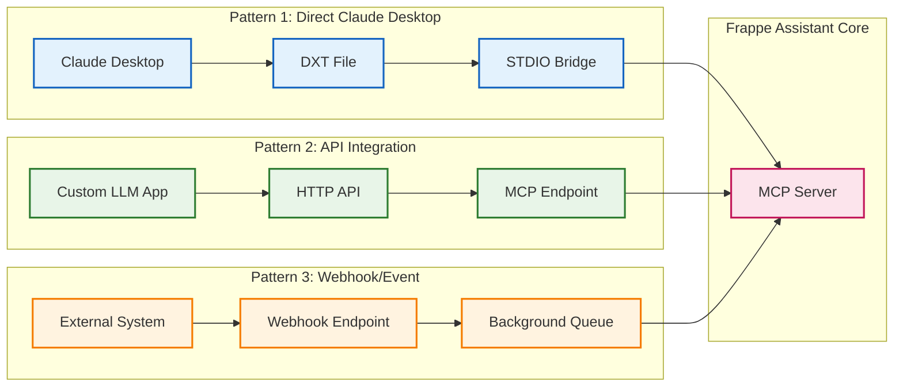
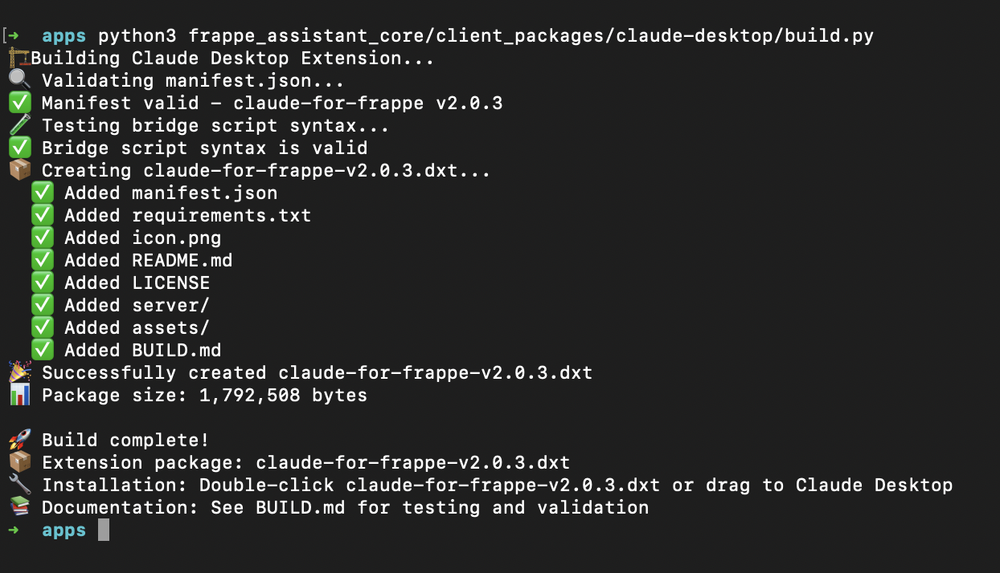
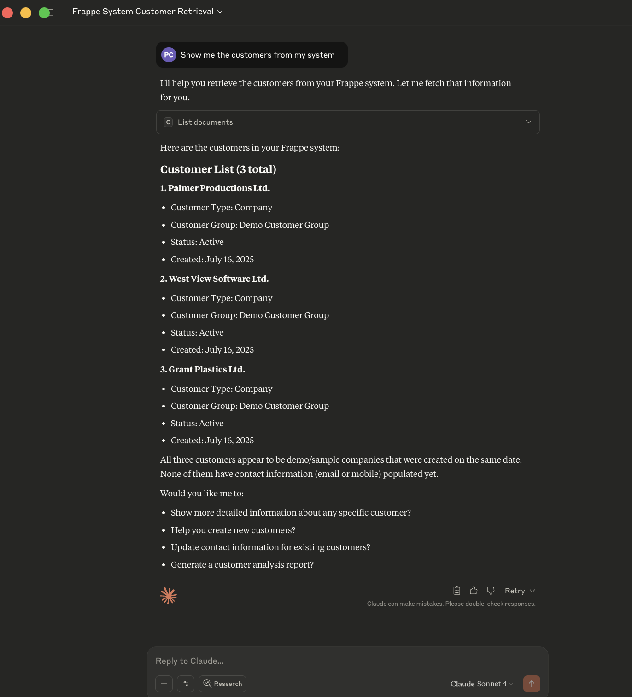

# Frappe Assistant Core

🔧 **LLM Integration Platform for ERPNext** - Give any Large Language Model the power to interact with your ERPNext system through standardized tools and protocols.

---

## 🌟 What is Frappe Assistant Core?

**Infrastructure that connects LLMs to ERPNext.** Frappe Assistant Core works with the Model Context Protocol (MCP) to expose ERPNext functionality to any compatible Language Model, enabling:

- **🔌 LLM-Agnostic Integration**: Works with Claude, GPT, custom models, or any MCP-compatible system
- **📁 One-Click Claude Setup**: Generate DXT files for instant Claude Desktop integration  
- **🔒 Enterprise Security**: ERPNext permissions, audit logging, and role-based access control
- **🛠️ 20+ Built-in Tools**: Document operations, search, reporting, analytics, and visualization
- **🚀 Plugin Architecture**: Extensible framework for custom business logic and integrations
- **🆓 Open Source**: AGPL-3.0 licensed - transparent, community-driven development

---

## ⚡ Quick Installation

Get up and running in 3 steps:

```bash
# 1. Get the app
cd frappe-bench
bench get-app https://github.com/buildswithpaul/Frappe_Assistant_Core

# 2. Install on your site  
bench --site [site-name] install-app frappe_assistant_core

# 3. Enable the assistant
bench --site [site-name] set-config assistant_enabled 1
```

**That's it!** Your AI assistant is now connected to your ERPNext data.

---

## 🎯 Core Components

### 🔧 **MCP Server Infrastructure**
Robust protocol handler that exposes ERPNext functionality through standardized tools.

### 📦 **Client Integration Packages** 
Ready-to-use integrations including DXT file generation for Claude Desktop setup.

### 🛠️ **20+ Built-in Tools**
Document CRUD, search, reporting, analytics, Python execution, and visualization capabilities.


*Comprehensive tool set for complete ERPNext integration*

### 🔌 **Plugin Architecture**
Extensible framework for custom tools, external app integration, and business-specific logic.


*Professional admin interface for plugin management and configuration*

### 🔒 **Enterprise Security Layer**
Authentication, ERPNext permissions integration, audit logging, and role-based access.


*Complete audit logging tracks all LLM interactions with your ERP data*

### 🌐 **LLM-Agnostic Design**
Compatible with any MCP-enabled system - not locked to specific AI providers.

### Architecture Overview



## Data Flow Architecture



## Plugin Architecture Detail



## Security & Permissions Flow



## Integration Patterns


*Plugin-based architecture supports any MCP-compatible LLM*

---

## 🚀 Getting Started

### Option 1: Claude Desktop (One-Click Setup)

Generate a DXT file for instant Claude Desktop integration:

```bash
# Generate DXT file for your site
bench --site yoursite execute frappe_assistant_core.client_packages.generate_dxt_file

# Install the generated .dxt file in Claude Desktop
# Double-click the file or drag to Claude Desktop
```


*One command generates a complete Claude Desktop integration file*

### Option 2: Manual MCP Configuration

Add to your Claude Desktop MCP configuration:

```json
{
  "mcpServers": {
    "frappe-assistant": {
      "command": "python",
      "args": ["/path/to/frappe_assistant_stdio_bridge.py"],
      "env": {
        "FRAPPE_SITE": "your-site.localhost", 
        "FRAPPE_API_KEY": "your-api-key",
        "FRAPPE_API_SECRET": "your-api-secret"
      }
    }
  }
}
```

### Option 3: Custom LLM Integration

For other LLMs or custom applications:

```python
# Connect via MCP protocol
import mcp_client

client = mcp_client.connect("http://yoursite.com/api/method/frappe_assistant_core.api.mcp.handle_request")
tools = client.list_tools()
result = client.call_tool("list_documents", {"doctype": "Customer"})
```

### Test Your Integration

Once connected, try these commands with any compatible LLM:

> "List all customers in the system"

> "Create a new customer called Acme Corp with email test@acme.com"

> "Show me sales data from this month and create a chart"


*Natural language commands create real ERPNext documents and generate insights*

The LLM will interact directly with your ERPNext data through the MCP tools.

---

## 📚 Documentation

| Guide | Description |
|-------|-------------|
| [🏗️ Architecture](docs/ARCHITECTURE.md) | System design and plugin architecture |
| [🔧 Tool Reference](docs/TOOL_REFERENCE.md) | Complete list of available tools |
| [🚀 Development Guide](docs/DEVELOPMENT_GUIDE.md) | Create custom tools and plugins |
| [🔒 Security Guide](docs/COMPREHENSIVE_SECURITY_GUIDE.md) | Security features and best practices |
| [📖 API Reference](docs/API_REFERENCE.md) | Complete API documentation |
| [⚡ Performance Guide](docs/PERFORMANCE.md) | Optimization and monitoring |

**New to AI + ERP?** Start with our [Getting Started Guide](docs/GETTING_STARTED.md)

---

## 🏢 Integration Scenarios

- **Business Users + Claude**: Natural language ERP operations through Claude Desktop
- **Developers + Custom LLMs**: Build AI-powered business applications with ERPNext data
- **System Integrators**: Deploy LLM-ERP solutions for clients across industries
- **AI Companies**: Add ERPNext capabilities to existing AI products and services
- **Enterprise Teams**: Create department-specific AI tools with custom plugins

---

## 🌟 Why Choose Frappe Assistant Core?

✅ **LLM-Agnostic** - Not locked to any specific AI provider or model  
✅ **Production Ready** - Enterprise-grade security, permissions, and audit logging  
✅ **One-Click Setup** - DXT file generation for instant Claude Desktop integration  
✅ **20+ Built-in Tools** - Comprehensive ERPNext functionality out of the box  
✅ **Plugin Architecture** - Unlimited extensibility for custom business logic  
✅ **Open Source** - AGPL-3.0 licensed with transparent, community-driven development  

---

## 🤝 Contributing

We welcome contributions! This is an open source project under AGPL-3.0.

1. Fork the repository
2. Create a feature branch  
3. Add tests for new functionality
4. Submit a pull request

See [Contributing Guidelines](Contributing.md) for detailed instructions.

---

## 📄 License & Support

**License**: AGPL-3.0 - Free for commercial use with source code transparency

**Community Support**: [GitHub Issues](https://github.com/buildswithpaul/Frappe_Assistant_Core/issues) and [Discussions](https://github.com/buildswithpaul/Frappe_Assistant_Core/discussions)

**Enterprise Support**: Need custom development or priority support? Contact us at jypaulclinton@gmail.com

---

**🚀 Ready to give LLMs access to your ERPNext data? [Get started now!](#-quick-installation)**

*Built with ❤️ by the community, for developers and businesses integrating AI with ERP systems.*