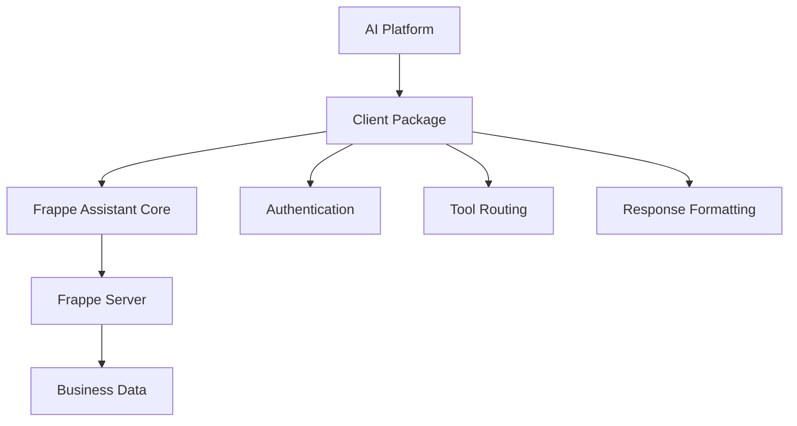

# Client Packages

This directory contains client-side packages and integrations for connecting various AI platforms and applications to the Frappe Assistant Core server.

## 🏗️ Architecture Overview

```
client_packages/
├── claude-desktop/          # Claude Desktop Extension (MCP)
├── chatgpt-plugin/          # ChatGPT Plugin (Future)
├── copilot-extension/       # GitHub Copilot Extension (Future)
├── api-sdk/                 # Direct API SDK (Future)
└── README.md               # This file
```

## 📦 Available Packages

### ✅ **Claude Desktop Extension** (`claude-desktop/`)
- **Status**: ✅ Production Ready
- **Type**: MCP (Model Context Protocol) Server
- **Platform**: Claude Desktop Application
- **Description**: Complete bridge between Claude Desktop and Frappe ERP systems
- **Features**: 21 tools for data analysis, document management, reporting, and visualization
- **Installation**: Download `.dxt` package from releases

### 🚧 **Future Packages**

#### **ChatGPT Plugin** (`chatgpt-plugin/`)
- **Status**: 🔮 Planned
- **Type**: OpenAI Plugin
- **Platform**: ChatGPT Plus/Enterprise
- **Description**: Plugin for ChatGPT to interact with Frappe ERP systems
- **Features**: Similar tool set adapted for ChatGPT interface

#### **GitHub Copilot Extension** (`copilot-extension/`)
- **Status**: 🔮 Planned
- **Type**: VS Code Extension
- **Platform**: GitHub Copilot / VS Code
- **Description**: Copilot extension for Frappe development workflows
- **Features**: Code generation, documentation, and development assistance

#### **Direct API SDK** (`api-sdk/`)
- **Status**: 🔮 Planned
- **Type**: Python/JavaScript SDK
- **Platform**: Any application
- **Description**: Direct API client library for custom integrations
- **Features**: Full programmatic access to all Frappe Assistant capabilities

## 🔧 Development Guidelines

### Package Structure

Each client package should follow this structure:

```
package-name/
├── README.md               # Package-specific documentation
├── CHANGELOG.md           # Version history
├── CONTRIBUTING.md        # Development guidelines
├── LICENSE               # Package license (MIT)
├── manifest.json         # Package configuration (if applicable)
├── requirements.txt      # Dependencies
├── src/                  # Source code
├── tests/               # Test files
├── docs/               # Package documentation
└── assets/             # Icons, screenshots, etc.
```

### Common Requirements

All client packages should:

1. **Maintain API Compatibility**: Use the same core API endpoints from Frappe Assistant Core
2. **Follow Security Standards**: Implement proper authentication and permission checking
3. **Provide Comprehensive Documentation**: Clear setup and usage instructions
4. **Include Error Handling**: Graceful error handling and user feedback
5. **Support Cross-Platform**: Work on Windows, macOS, and Linux where applicable

### Tool Mapping

All packages should provide access to the same core tool set:

#### 📊 **Data Analysis Tools**
- `execute_python_code` - Custom Python execution
- `analyze_frappe_data` - Statistical analysis
- `query_and_analyze` - SQL queries with analysis
- `create_visualization` - Interactive charts

#### 📋 **Document Management Tools**
- `document_create` - Create documents
- `document_get` - Retrieve documents
- `document_update` - Update documents
- `document_list` - List and filter documents

#### 🔍 **Search Tools**
- `search_global` - Global search
- `search_doctype` - DocType-specific search
- `search_link` - Link field search

#### 📈 **Reporting Tools**
- `report_execute` - Run reports
- `report_list` - List available reports
- `report_columns` - Get report structure

#### 🔧 **Metadata Tools**
- `metadata_doctype` - DocType information
- `metadata_list_doctypes` - List DocTypes
- `metadata_permissions` - Permission information
- `metadata_workflow` - Workflow information

#### 🔄 **Workflow Tools**
- `start_workflow` - Start workflows
- `get_workflow_state` - Get workflow status
- `get_workflow_actions` - Get available actions

## 🚀 Adding New Packages

To add a new client package:

1. **Create Package Directory**
   ```bash
   mkdir client_packages/new-package-name
   cd client_packages/new-package-name
   ```

2. **Set Up Package Structure**
   ```bash
   # Create standard files
   touch README.md CHANGELOG.md CONTRIBUTING.md LICENSE
   touch requirements.txt manifest.json
   mkdir src tests docs assets
   ```

3. **Implement Core Features**
   - Connection to Frappe Assistant Core API
   - Authentication handling
   - Tool implementations for the target platform
   - Error handling and logging

4. **Add Documentation**
   - Update this README with the new package
   - Create package-specific documentation
   - Add installation and usage instructions

5. **Testing**
   - Write comprehensive tests
   - Test with actual Frappe instances
   - Validate cross-platform compatibility

## 🔗 Integration Flow



### Common Integration Pattern

1. **Authentication**: Client authenticates with Frappe server using API keys
2. **Tool Discovery**: Client discovers available tools from server
3. **Request Routing**: Client routes AI requests to appropriate tools
4. **Response Processing**: Client formats responses for the AI platform
5. **Error Handling**: Client provides user-friendly error messages

## 📞 Support

- **Main Project**: [Frappe_Assistant_Core](https://github.com/clinu/Frappe_Assistant_Core)
- **Issues**: [GitHub Issues](https://github.com/clinu/Frappe_Assistant_Core/issues)
- **Discussions**: [GitHub Discussions](https://github.com/clinu/Frappe_Assistant_Core/discussions)
- **Documentation**: [Project Docs](https://github.com/clinu/Frappe_Assistant_Core/blob/main/docs/)

## 📄 License

All client packages are licensed under the MIT License. See individual package LICENSE files for details.

---

**Building the future of AI-powered ERP interactions** 🚀