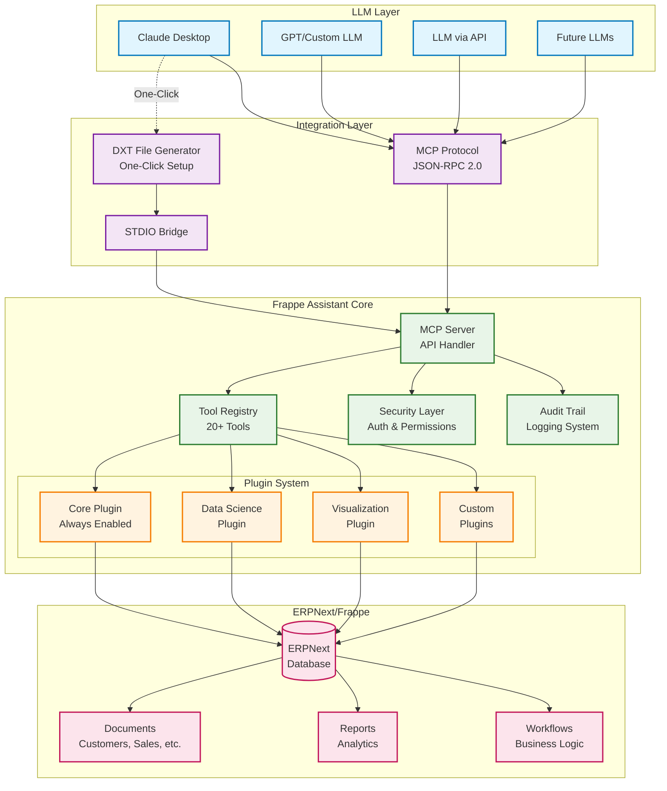
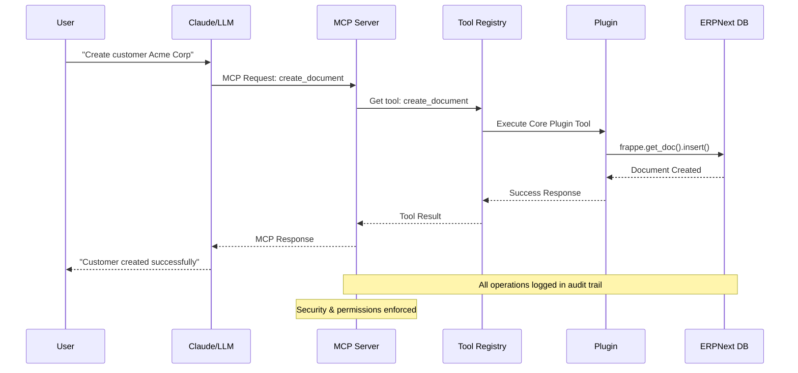
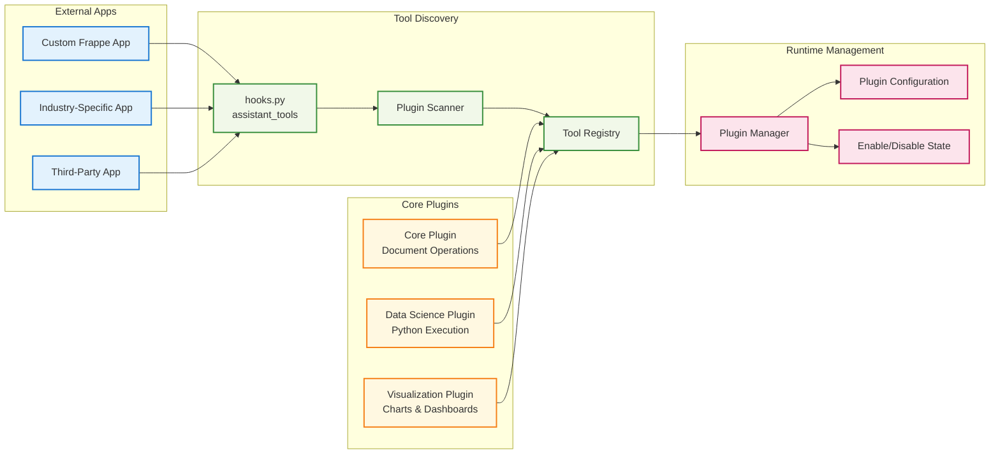
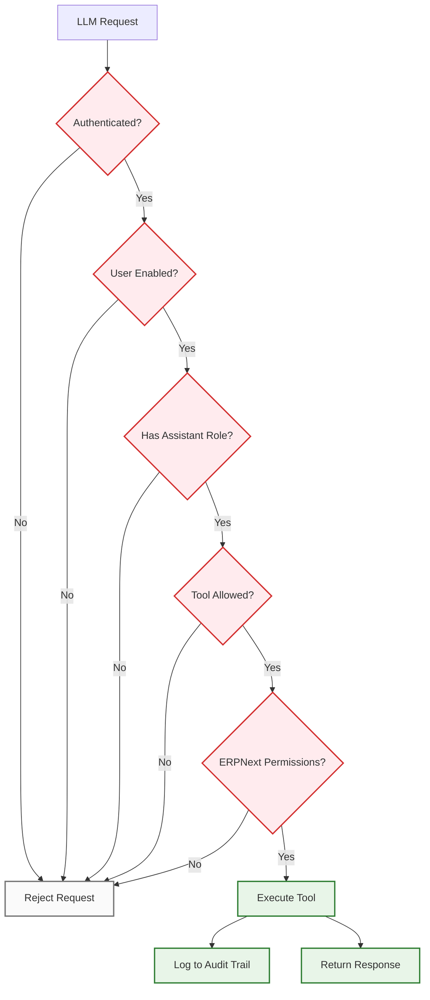
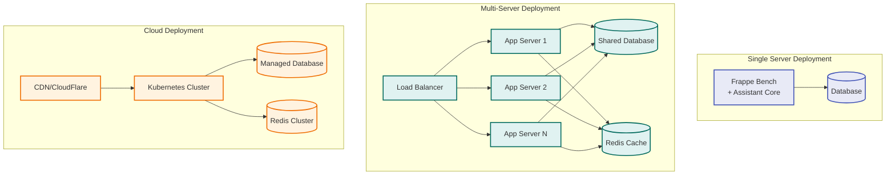
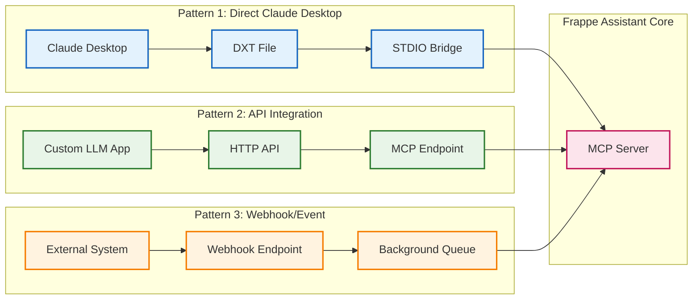

# Architecture Diagram

## System Overview

## Data Flow Architecture

## Plugin Architecture Detail

## Security & Permissions Flow

## Deployment Architecture Options

## Integration Patterns

