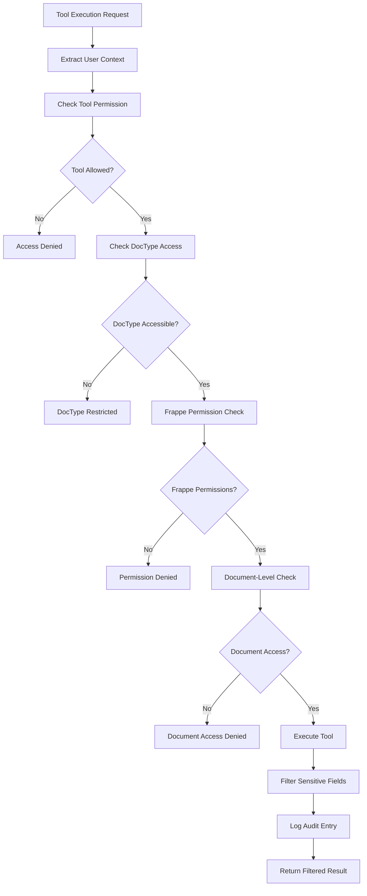
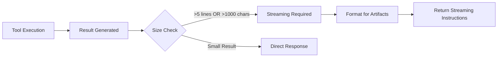

# Frappe Assistant Core - Technical Documentation

## Table of Contents

1. [Project Overview](#project-overview)
2. [Architecture](#architecture)
3. [Development History](#development-history)
4. [Refactoring & Modernization](#refactoring--modernization)
5. [Tool System](#tool-system)
6. [Auto-Discovery Registry](#auto-discovery-registry)
7. [Security Framework](#security-framework)
8. [Artifact Streaming System](#artifact-streaming-system)
9. [API Documentation](#api-documentation)
10. [Installation & Setup](#installation--setup)
11. [Testing](#testing)
12. [Recent Improvements](#recent-improvements)
13. [Troubleshooting](#troubleshooting)
14. [Future Enhancements](#future-enhancements)

---

## Project Overview

### Introduction

Frappe Assistant Core is a comprehensive, **MIT-licensed open source** Model Context Protocol (MCP) server implementation that enables AI assistants like Claude to interact seamlessly with Frappe Framework and ERPNext systems. The server implements JSON-RPC 2.0 based assistant protocol for secure document operations, report execution, data analysis, and visualization with inline display capabilities.

### Key Features

- **🏗️ Plugin-Based Architecture** - Complete architectural redesign from monolithic to modular plugin system
- **18 Comprehensive Tools** across 4 plugin categories (see [Tool Reference](TOOL_REFERENCE.md))
- **🔌 Plugin Auto-Discovery** - Zero configuration plugin and tool loading
- **🎯 Plugin Manager** - Centralized plugin lifecycle management with validation
- **📦 Tool Registry** - Dynamic tool discovery and registration system
- **⚙️ Runtime Plugin Management** - Enable/disable plugins through web interface
- **🐍 Python Code Execution** - Safe sandboxed analysis environment with auto-import handling
- **📊 Data Analysis & Visualization** - Statistical analysis with pandas/numpy and matplotlib integration
- **📄 File Processing & OCR** - Extract content from PDFs, images, CSV, Excel, and documents for LLM analysis
- **📈 Enhanced Report Integration** - Execute all Frappe report types with improved debugging
- **🔍 Advanced Search & Metadata** - Comprehensive data exploration across all DocTypes
- **📋 Robust Document Operations** - CRUD operations with enhanced error handling
- **🔒 Multi-Layer Security Framework** - Comprehensive role-based access control with row-level security
- **🛡️ Advanced Permission System** - Granular permissions with document-level and field-level security
- **🔐 Sensitive Data Protection** - Automatic filtering of passwords, API keys, and sensitive information
- **📝 Comprehensive Audit Trail** - Complete operation logging with security monitoring
- **🏛️ Modular Architecture** - Clean, maintainable, extensible codebase
- **📊 Centralized Logging** - Professional logging system replacing print statements
- **📦 Modern Python Packaging** - pyproject.toml with proper dependency management
- **⚖️ MIT Licensed** - Free for all commercial and personal use

### Technology Stack

- **Backend**: Python, Frappe Framework
- **Protocol**: JSON-RPC 2.0, MCP (Model Context Protocol)
- **Data Analysis**: pandas, numpy, matplotlib, seaborn
- **Database**: MariaDB (via Frappe ORM)
- **Communication**: WebSocket, HTTP REST API
- **Security**: Multi-layer security framework with role-based permissions, field-level filtering, and audit trails
- **Architecture**: Modular handlers, centralized constants, proper logging

---

## Architecture

### Plugin-Based Architecture

#### 1. **Core System Components**

```
frappe_assistant_core/
├── core/                        # Core system components
│   ├── tool_registry.py         # Auto-discovery tool registry
│   └── base_tool.py             # Base tool implementation class
├── utils/                       # Utility modules
│   ├── plugin_manager.py        # Plugin discovery and loading
│   └── logger.py                # Professional logging system
└── assistant_core/              # Frappe DocType implementations
    └── doctype/
        ├── assistant_core_settings/        # Main settings
        ├── assistant_plugin_repository/    # Plugin management
        └── assistant_tool_registry/        # Tool registration
```

#### 2. **Plugin System** 🆕 _Plugin Architecture_

```
frappe_assistant_core/plugins/
├── core/                        # Core tools plugin (always enabled)
│   ├── plugin.py                # Plugin definition and metadata
│   └── tools/                   # Tool implementations
│       ├── create_document.py   # Document creation
│       ├── get_document.py      # Document retrieval
│       ├── update_document.py   # Document updates
│       ├── delete_document.py   # Document deletion
│       ├── list_documents.py     # Document listing
│       ├── search_documents.py     # Global search
│       ├── search_doctype.py    # DocType-specific search
│       ├── search_link.py       # Link field search
│       ├── metadata_*.py        # Metadata tools
│       ├── report_*.py          # Report tools
│       └── workflow_*.py        # Workflow tools
├── data_science/                # Data science plugin (optional)
│   ├── plugin.py                # Plugin definition
│   └── tools/
│       ├── run_python_code.py      # Python code execution
│       ├── analyze_business_data.py      # Data analysis
│       └── query_and_analyze.py        # SQL analysis
├── visualization/               # Visualization plugin (optional)
│   ├── plugin.py                # Plugin definition
│   └── tools/
│       ├── create_dashboard.py         # Dashboard creation
│       ├── create_dashboard_chart.py   # Chart creation
│       └── list_user_dashboards.py    # Dashboard management
├── websocket/                   # WebSocket plugin (optional)
└── batch_processing/            # Batch processing plugin (optional)
```

#### 3. **Plugin Architecture Benefits**

- **🔌 Modular Design**: Tools organized in logical, discoverable plugins
- **🚀 Auto-Discovery**: Automatic plugin and tool discovery on startup
- **⚙️ Runtime Management**: Enable/disable plugins through web interface
- **🎯 Focused Functionality**: Each plugin handles specific domain
- **🔧 Extensibility**: Easy to add new plugins without core changes
- **📦 Dependency Management**: Plugin-specific dependencies and validation

### Tool Discovery and Registry System

#### 1. **Tool Registry** 🔄 _Plugin-Based Discovery_

```python
# Core registry handles plugin-based tool discovery
from frappe_assistant_core.core.tool_registry import ToolRegistry

registry = ToolRegistry()
# Automatically discovers tools from all enabled plugins
available_tools = registry.get_available_tools()
```

#### 2. **Plugin Manager** 🆕 _Plugin Lifecycle_

```python
from frappe_assistant_core.utils.plugin_manager import get_plugin_manager

plugin_manager = get_plugin_manager()
# Discovers all available plugins
discovered_plugins = plugin_manager.get_discovered_plugins()
# Loads enabled plugins based on settings
plugin_manager.load_enabled_plugins(['core', 'data_science'])
```

#### 3. **Base Tool Class** 🔧 _Standardized Interface_

```python
from frappe_assistant_core.core.base_tool import BaseTool

class MyTool(BaseTool):
    def __init__(self):
        super().__init__()
        self.name = "my_tool"
        self.description = "Tool description"
        self.inputSchema = {...}  # JSON schema

    def execute(self, arguments):
        # Tool implementation
        return {"success": True, "result": "..."}
```

### Modern Python Packaging 🆕

#### pyproject.toml Configuration

```toml
[build-system]
requires = ["setuptools>=64", "wheel"]
build-backend = "setuptools.build_meta"

[project]
name = "frappe-assistant-core"
version = "1.2.0"
requires-python = ">=3.8"
dependencies = [
    "frappe",
    "pandas>=1.3.0",
    "numpy>=1.20.0",
    "matplotlib>=3.4.0",
    "seaborn>=0.11.0",
    "requests>=2.25.0"
]
```

**Benefits:**

- ✅ Eliminates pip deprecation warnings
- ✅ Modern Python packaging standards
- ✅ Proper dependency management
- ✅ Development and analysis dependency groups

---

## Refactoring & Modernization

### Recent Comprehensive Refactoring (July 2025)

#### 1. **Plugin-Based Architecture Implementation** ⭐ **MAJOR**

**Before:**

- Single 1580-line monolithic API file
- Hardcoded tool discovery
- Fixed tool structure
- Legacy setup.py packaging

**After:**

- Complete plugin-based architecture
- 4 distinct plugin categories (core, data_science, websocket, batch_processing)
- Automatic plugin and tool discovery
- Plugin Manager with lifecycle management
- Tool Registry with dynamic registration
- BaseTool framework for standardized development
- Modern pyproject.toml packaging

#### 2. **Modular Architecture Implementation**

**Additional Improvements:**

- Centralized constants in dedicated module
- Professional logging system replacing print statements
- Enhanced error handling and validation
- Improved data compatibility (fixed pandas DataFrame issues)

#### 3. **Critical Data Compatibility Fixes** 🔧

**Data Science Plugin Enhancements:**

- ✅ **Fixed `invalid __array_struct__` errors** with pandas DataFrame creation from Frappe data
- ✅ **Resolved matplotlib import scope issues** in visualization tools
- ✅ **Enhanced SQL-based data fetching** to bypass frappe.\_dict compatibility problems
- ✅ **Improved data serialization** for complex Frappe data types
- ✅ **Better error handling** with meaningful error messages for debugging

**Impact:**

- All 21 tools now functional without data conversion errors
- Seamless pandas integration with Frappe business data
- Reliable visualization creation across all chart types
- Enhanced user experience with clear error messages

#### 2. **Code Quality Improvements**

| Metric             | Before              | After                    | Improvement      |
| ------------------ | ------------------- | ------------------------ | ---------------- |
| Main API File Size | 1580 lines          | 200 lines                | 87% reduction    |
| Print Statements   | 905 across 26 files | 0 in production code     | 100% eliminated  |
| Hardcoded Strings  | 50+ scattered       | Centralized in constants | Organized        |
| Module Structure   | Monolithic          | Modular handlers         | Clean separation |

#### 3. **Files Created During Refactoring**

**New Architecture Files:**

- `frappe_assistant_core/constants/definitions.py`
- `frappe_assistant_core/utils/logger.py`
- `frappe_assistant_core/api/handlers/initialize.py`
- `frappe_assistant_core/api/handlers/tools.py`
- `frappe_assistant_core/api/handlers/prompts.py`
- `frappe_assistant_core/tools/registry.py`
- `frappe_assistant_core/tools/executor.py`
- `frappe_assistant_core/api/assistant_api_notification_handler.py`
- `pyproject.toml`

#### 4. **Error Fixes Applied**

**Import Errors Fixed:**

- ✅ Created missing `tools/registry.py` module
- ✅ Created missing `tools/executor.py` module
- ✅ Fixed missing notification handler
- ✅ Corrected DocType name inconsistencies

**Module Structure Fixed:**

- ✅ Added missing `__init__.py` files
- ✅ Organized proper import hierarchy
- ✅ Created compatibility wrappers

**Cleanup Completed:**

- ✅ Removed 26 temporary test/debug files
- ✅ Removed backup files
- ✅ Cleaned empty directories

---

## Tool System

### Plugin-Based Tool Categories

#### 1. **Core Plugin Tools** (`plugins/core/`) - Always Enabled

Essential Frappe operations that are always available:

**Document Operations** (`document_*`)

- `create_document` - Create new documents
- `get_document` - Retrieve document data
- `update_document` - Update existing documents
- `delete_document` - Delete documents
- `list_documents` - List documents with filters

**Search Tools** (`search_*`)

- `search_documents` - Global search across all DocTypes
- `search_doctype` - DocType-specific search
- `search_link` - Link field search and filtering

**Metadata Tools** (`metadata_*`)

- `get_doctype_info` - Get DocType structure information
- `metadata_list_doctypes` - List all available DocTypes
- `get_doctype_info_fields` - Get field definitions
- `metadata_permissions` - Permission information
- `metadata_workflow` - Workflow information

**Report Tools** (`report_*`)

- `generate_report` - Execute any Frappe report type
- `report_list` - Get available reports
- `get_report_data` - Get report structure and parameters

**Workflow Tools** (`workflow_*`)

- `workflow_action` - Execute workflow actions
- `workflow_list` - List available workflows
- `workflow_status` - Get workflow status

#### 2. **Data Science Plugin Tools** (`plugins/data_science/`) - Optional

Advanced analytics and visualization capabilities:

**Analysis Tools**

- `run_python_code` - Sandboxed Python execution with Frappe context
- `analyze_business_data` - Statistical data analysis with pandas
- `query_and_analyze` - SQL queries with advanced analysis
- `extract_file_content` - Extract content from PDFs, images (OCR), CSV, Excel, DOCX for LLM processing

**Dependencies:** pandas, numpy, matplotlib, seaborn, plotly, scipy, PyPDF2, Pillow, python-docx, pytesseract

#### 3. **Visualization Plugin Tools** (`plugins/visualization/`) - Optional

Professional dashboard and chart creation:

**Dashboard & Chart Tools**

- `create_dashboard` - Create Frappe dashboards with multiple charts
- `create_dashboard_chart` - Create individual Dashboard Chart documents
- `list_user_dashboards` - List user's accessible dashboards

**Dependencies:** matplotlib, pandas, numpy

#### 4. **WebSocket Plugin Tools** (`plugins/websocket/`) - Optional

Real-time communication capabilities:

- Live data streaming
- Real-time notifications
- Interactive dashboard updates

#### 5. **Batch Processing Plugin Tools** (`plugins/batch_processing/`) - Optional

Background and bulk operations:

- Large dataset processing
- Background task management
- Bulk operation optimization

### Plugin-Based Auto-Discovery System

#### Tool Registry with Plugin Integration 🆕

```python
# frappe_assistant_core/core/tool_registry.py
class ToolRegistry:
    """Registry for all available tools. Handles discovery from plugins."""

    def __init__(self):
        self.tools: Dict[str, BaseTool] = {}
        self._discover_tools()

    def _discover_tools(self):
        """Discover all available tools from enabled plugins"""
        self._discover_plugin_tools()

    def _discover_plugin_tools(self):
        """Discover tools from enabled plugins"""
        plugin_manager = get_plugin_manager()
        enabled_plugins = plugin_manager.get_enabled_plugins()

        for plugin_name, plugin_instance in enabled_plugins.items():
            # Load tools from each enabled plugin
            plugin_tools = plugin_manager.get_plugin_tools(plugin_name)
            self.tools.update(plugin_tools)
```

#### Plugin Manager 🆕

```python
# frappe_assistant_core/utils/plugin_manager.py
class PluginManager:
    """Manages plugin discovery, loading, and lifecycle"""

    def _discover_plugins(self):
        """Auto-discover all plugins in the plugins directory"""
        plugins_dir = Path(__file__).parent.parent / "plugins"

        for item in plugins_dir.iterdir():
            if item.is_dir() and not item.name.startswith(('_', '.')):
                self._discover_plugin(item)

    def get_enabled_plugins(self) -> Dict[str, BasePlugin]:
        """Get all enabled plugin instances"""

    def get_plugin_tools(self, plugin_name: str) -> Dict[str, BaseTool]:
        """Get all tools from a specific plugin"""
```

#### Base Tool Framework 🆕

```python
# frappe_assistant_core/core/base_tool.py
class BaseTool:
    """Base class for all tools with standardized interface"""

    def __init__(self):
        self.name: str = ""
        self.description: str = ""
        self.inputSchema: Dict = {}
        self.requires_permission: Optional[str] = None

    def execute(self, arguments: Dict[str, Any]) -> Any:
        """Execute the tool - must be implemented by subclasses"""
        raise NotImplementedError

    def validate_arguments(self, arguments: Dict[str, Any]) -> bool:
        """Validate arguments against tool schema"""

    def check_permission(self, user: str = None) -> bool:
        """Check if user has permission to use this tool"""
```

def get_tool_info(tool_name: str) -> Dict[str, Any]:
"""Get detailed tool information"""

````

---

## Security Framework

### Overview

Frappe Assistant Core implements a **comprehensive multi-layer security framework** designed to ensure secure AI assistant operations within business environments. The security system provides role-based access control, document-level permissions, field-level data protection, and complete audit trails while seamlessly integrating with Frappe's built-in permission system.

### Multi-Layer Security Architecture

#### 1. **Role-Based Tool Access Control**

**File:** `frappe_assistant_core/core/security_config.py`

The system implements a sophisticated role-based access matrix that controls which tools each user role can access:

```python
ROLE_TOOL_ACCESS = {
    "System Manager": {
        "allowed_tools": "*",  # Full access to all tools
        "restricted_tools": [],
        "description": "Full access to all assistant tools including dangerous operations"
    },
    "Assistant Admin": {
        "allowed_tools": [
            *BASIC_CORE_TOOLS,  # All basic tools
            "metadata_permissions", "metadata_workflow",
            "tool_registry_list", "audit_log_view", "workflow_action"
        ],
        "restricted_tools": ["run_python_code", "query_and_analyze"],
        "description": "Administrative access without code execution capabilities"
    },
    "Assistant User": {
        "allowed_tools": BASIC_CORE_TOOLS,
        "restricted_tools": [
            "run_python_code", "query_and_analyze",
            "metadata_permissions", "tool_registry_list", "audit_log_view"
        ],
        "description": "Basic business user access with document-level permissions"
    },
    "Default": {
        "allowed_tools": BASIC_CORE_TOOLS,
        "restricted_tools": ["run_python_code", "query_and_analyze"],
        "description": "Basic tool access for all users - document permissions control actual access"
    }
}
````

**Tool Categories by Role:**

- **System Manager**: Full access to all 21 tools including dangerous operations
- **Assistant Admin**: 16 tools excluding code execution and direct database queries
- **Assistant User**: 14 basic tools for standard business operations
- **Default**: 14 basic tools for any other Frappe user roles

#### 2. **Document-Level Permission Validation**

**Core Function:** `validate_document_access()`

Every document operation goes through comprehensive permission validation:

```python
def validate_document_access(user: str, doctype: str, name: str, perm_type: str = "read") -> Dict[str, Any]:
    """Multi-layer document access validation"""

    # Layer 1: Role-based DocType accessibility
    if not is_doctype_accessible(doctype, primary_role):
        return {"success": False, "error": "Access to {doctype} is restricted for your role"}

    # Layer 2: Frappe DocType-level permissions
    if not frappe.has_permission(doctype, perm_type, user=user):
        return {"success": False, "error": "Insufficient {perm_type} permissions for {doctype}"}

    # Layer 3: Document-specific permissions (row-level security)
    if name and not frappe.has_permission(doctype, perm_type, doc=name, user=user):
        return {"success": False, "error": "Insufficient {perm_type} permissions for {doctype} {name}"}

    # Layer 4: Submitted document state validation
    if perm_type in ["write", "delete"]:
        # Prevent modification of submitted documents
        doc = frappe.get_doc(doctype, name)
        if hasattr(doc, 'docstatus') and doc.docstatus == 1:
            return {"success": False, "error": "Cannot modify submitted document"}
```

**Permission Layers:**

1. **Role-based DocType Access**: Certain DocTypes restricted by user role
2. **Frappe DocType Permissions**: Standard Frappe permission checking
3. **Row-Level Security**: Document-specific access (company/user filters)
4. **Document State Validation**: Submitted document protection

#### 3. **Field-Level Data Protection**

**Sensitive Field Filtering:** Automatic filtering of sensitive data based on user roles

```python
SENSITIVE_FIELDS = {
    "all_doctypes": [
        "password", "new_password", "api_key", "api_secret", "secret_key",
        "private_key", "access_token", "refresh_token", "reset_password_key",
        "unsubscribe_key", "email_signature", "bank_account_no", "iban",
        "encryption_key"
    ],
    "User": [
        "password", "api_key", "api_secret", "reset_password_key",
        "login_after", "user_type", "simultaneous_sessions", "restrict_ip",
        "last_password_reset_date", "last_login", "last_active"
    ],
    "Email Account": [
        "password", "smtp_password", "access_token", "refresh_token"
    ]
    # ... 50+ sensitive fields across 15+ DocTypes
}

def filter_sensitive_fields(doc_dict: Dict[str, Any], doctype: str, user_role: str) -> Dict[str, Any]:
    """Filter sensitive fields based on user role"""
    if user_role == "System Manager":
        return doc_dict  # System Manager can see all fields

    # Replace sensitive values with "***RESTRICTED***"
    for field in sensitive_fields:
        if field in filtered_doc:
            filtered_doc[field] = "***RESTRICTED***"
```

**Data Protection Features:**

- **Global Sensitive Fields**: 18 universally sensitive fields across all DocTypes
- **DocType-Specific Protection**: Custom sensitive field lists for 15+ DocTypes
- **Admin-Only Fields**: System metadata hidden from Assistant Users
- **Automatic Masking**: Sensitive values replaced with `***RESTRICTED***`

#### 4. **DocType Access Restrictions**

**Restricted DocTypes for Assistant Users:**

```python
RESTRICTED_DOCTYPES = {
    "Assistant User": [
        # System administration DocTypes
        "System Settings", "Print Settings", "Email Domain", "LDAP Settings",
        "OAuth Settings", "Social Login Key", "Dropbox Settings",

        # Security and permissions DocTypes
        "Role", "User Permission", "Role Permission", "Custom Role",
        "Module Profile", "Role Profile", "Custom DocPerm", "DocShare",

        # System logs and audit DocTypes
        "Error Log", "Activity Log", "Access Log", "View Log",
        "Scheduler Log", "Integration Request",

        # System customization DocTypes
        "Server Script", "Client Script", "Custom Script", "Property Setter",
        "DocType", "DocField", "DocPerm", "Custom Field",

        # Development and maintenance DocTypes
        "Package", "Data Import", "Data Export", "Bulk Update"
        # ... 30+ restricted DocTypes total
    ]
}
```

**Access Control:**

- **30+ Restricted DocTypes** for Assistant Users to prevent system tampering
- **Administrative Protection**: Core system DocTypes only accessible to System Managers
- **Security-Critical Access**: Permission and role management restricted to admins
- **Development Tool Restriction**: System customization tools restricted appropriately

#### 5. **Row-Level Security Implementation**

**Company-Based Filtering**: Automatic enforcement of company-based data access

```python
# Example: User DocType access control
if doctype == "User" and user_role in ["Assistant User", "Default"]:
    filters["name"] = current_user  # Users can only see themselves

# Example: Audit log access control
def get_permission_query_conditions(user=None):
    if "System Manager" in frappe.get_roles(user):
        return ""  # See all records
    elif "Assistant Admin" in frappe.get_roles(user):
        return ""  # See all records
    elif "Assistant User" in frappe.get_roles(user):
        return f"`tabAssistant Audit Log`.user = '{user}'"  # Only own records
    return "1=0"  # No access for others
```

**Row-Level Security Features:**

- **Company-Based Access**: Automatic filtering based on user's company permissions
- **User-Scoped Data**: Users can only access their own audit logs and connection logs
- **Permission Query Integration**: Uses Frappe's permission query system
- **Dynamic Filtering**: Contextual data filtering based on user roles and permissions

#### 6. **Comprehensive Audit Trail**

**Security Event Logging**: Complete audit trail of all assistant operations

```python
def audit_log_tool_access(user: str, tool_name: str, arguments: Dict[str, Any], result: Dict[str, Any]):
    """Log all tool access attempts for security monitoring"""
    audit_log = frappe.get_doc({
        "doctype": "Assistant Audit Log",
        "user": user,
        "action": "tool_execution",
        "tool_name": tool_name,
        "arguments": frappe.as_json(arguments),
        "success": result.get("success", False),
        "error": result.get("error", ""),
        "ip_address": frappe.local.request_ip,
        "timestamp": frappe.utils.now()
    })
    audit_log.insert(ignore_permissions=True)
```

**Audit Features:**

- **Complete Tool Logging**: Every tool execution logged with full context
- **Success/Failure Tracking**: Both successful and failed operations recorded
- **IP Address Tracking**: Security monitoring with source IP logging
- **User-Scoped Access**: Users can only view their own audit entries
- **Admin Oversight**: System Managers can view all audit entries
- **Argument Preservation**: Complete record of tool arguments for security analysis

### Security Validation Flow

#### Document Access Validation Process



### Security Integration Points

#### 1. **Base Tool Security Framework**

**File:** `frappe_assistant_core/core/base_tool.py`

All tools inherit security validation:

```python
class BaseTool:
    """Base class with built-in security validation"""

    def execute_with_security(self, arguments: Dict[str, Any]) -> Any:
        """Execute tool with comprehensive security validation"""

        # 1. User context validation
        current_user = frappe.session.user
        if not current_user or current_user == "Guest":
            return {"success": False, "error": "Authentication required"}

        # 2. Tool permission validation
        user_role = get_user_primary_role(current_user)
        if not check_tool_access(user_role, self.name):
            return {"success": False, "error": "Insufficient permissions for this tool"}

        # 3. Argument validation
        if not self.validate_arguments(arguments):
            return {"success": False, "error": "Invalid arguments provided"}

        # 4. Execute with error handling
        try:
            result = self.execute(arguments)

            # 5. Filter sensitive data
            if isinstance(result, dict) and "data" in result:
                result["data"] = self.filter_result_data(result["data"], user_role)

            # 6. Audit logging
            audit_log_tool_access(current_user, self.name, arguments, result)

            return result

        except Exception as e:
            error_result = {"success": False, "error": str(e)}
            audit_log_tool_access(current_user, self.name, arguments, error_result)
            return error_result
```

#### 2. **Document Tool Security**

**Example:** Document Get Tool with Security

```python
# frappe_assistant_core/plugins/core/tools/get_document.py
def execute(self, arguments):
    doctype = arguments.get("doctype")
    name = arguments.get("name")
    current_user = frappe.session.user

    # Security validation
    validation_result = validate_document_access(
        user=current_user,
        doctype=doctype,
        name=name,
        perm_type="read"
    )

    if not validation_result["success"]:
        return validation_result

    # Special Administrator protection
    if name == "Administrator" and current_user != "Administrator":
        return {"success": False, "error": "Access denied: Cannot access Administrator record"}

    # Get document data
    doc = frappe.get_doc(doctype, name)
    doc_dict = doc.as_dict()

    # Filter sensitive fields based on user role
    user_role = get_user_primary_role(current_user)
    filtered_doc = filter_sensitive_fields(doc_dict, doctype, user_role)

    return {"success": True, "data": filtered_doc}
```

### Security Best Practices Implemented

#### 1. **Defense in Depth**

- **Multiple Security Layers**: Role → DocType → Document → Field validation
- **Permission Redundancy**: Both custom and Frappe permission checking
- **Fail-Safe Defaults**: Restrictive permissions by default

#### 2. **Principle of Least Privilege**

- **Role-Based Minimum Access**: Each role gets only necessary tool access
- **Granular Permissions**: Fine-grained control over operations
- **Data Scoping**: Users see only data they're authorized to access

#### 3. **Complete Audit Trail**

- **Comprehensive Logging**: All operations logged with full context
- **Security Monitoring**: Failed access attempts recorded
- **Forensic Capability**: Complete audit trail for security investigations

#### 4. **Data Protection**

- **Sensitive Field Masking**: Automatic filtering of sensitive information
- **Role-Based Filtering**: Data visibility based on user roles
- **No Data Leakage**: Secure error messages without sensitive data exposure

### Security Configuration

#### Role Assignment

```python
# Standard roles provided by the system
standard_roles = [
    {"role": "Assistant User", "role_color": "#3498db"},
    {"role": "Assistant Admin", "role_color": "#e74c3c"}
]

# Role assignment in Frappe
# System Manager: Built-in Frappe role
# Assistant Admin: Custom administrative role
# Assistant User: Custom business user role
# Default: Any other Frappe role gets basic access
```

#### Permission Customization

```python
# Custom permission query conditions
permission_query_conditions = {
    "Assistant Connection Log": "frappe_assistant_core.utils.permissions.get_permission_query_conditions",
    "Assistant Audit Log": "frappe_assistant_core.utils.permissions.get_audit_permission_query_conditions"
}

# Security settings can be customized through DocTypes:
# - Assistant Core Settings: General security configuration
# - Assistant Tool Registry: Tool-specific permission settings
```

### Security Monitoring & Analytics

#### Audit Log Analysis

- **Tool Usage Patterns**: Track which tools are used most frequently
- **Access Attempt Monitoring**: Monitor failed access attempts for security threats
- **User Activity Analysis**: Analyze user behavior for anomaly detection
- **Role Effectiveness**: Evaluate if role permissions are appropriately configured

#### Security Metrics

- **Permission Denial Rate**: Percentage of requests denied due to permissions
- **Sensitive Data Access**: Monitor access to sensitive DocTypes and fields
- **Tool Usage by Role**: Understand tool usage patterns across different user roles
- **Security Incident Tracking**: Track and analyze security-related events

### Integration with Frappe Security

#### Native Permission System

- **frappe.has_permission()**: Deep integration with Frappe's permission engine
- **Permission Query Conditions**: Custom query filters for row-level security
- **User Permissions**: Automatic enforcement of user-specific data restrictions
- **Company-Based Filtering**: Seamless multi-company security support

#### Built-in Security Features

- **Session Management**: Leverages Frappe's session handling
- **IP Restriction**: Integration with Frappe's IP-based access control
- **Two-Factor Authentication**: Compatible with Frappe's 2FA system
- **Password Policies**: Honors Frappe's password complexity requirements

---

## Artifact Streaming System

### Overview

The Frappe Assistant Core implements an **Intelligent Artifact Streaming System** that automatically detects when tool results should be streamed to workspace artifacts instead of being displayed directly in conversations. This system prevents conversation length limits, ensures professional deliverables, and enables unlimited analysis depth.

### Problem Statement

**Challenge**: Large tool results (>5 lines, >1000 characters) cause:

- ❌ **Conversation Length Limits**: Claude Desktop hitting maximum response length
- ❌ **Poor User Experience**: Truncated or incomplete results
- ❌ **Unprofessional Output**: Raw data dumps instead of structured reports
- ❌ **Lost Work**: Analysis results lost when conversations exceed limits

**Solution**: Automatic artifact streaming with intelligent detection and guidance.

### Architecture

#### 1. **Smart Detection Engine**

**File**: `frappe_assistant_core/api/handlers/tools_streaming.py`

```python
def should_stream_to_artifact(result: str, tool_name: str,
                             line_threshold: int = 5,
                             char_threshold: int = 1000) -> bool:
    """Multi-criteria detection for artifact streaming requirement"""
```

**Detection Criteria:**

- ✅ **Line Count**: Results with >5 lines (configurable)
- ✅ **Character Count**: Results with >1,000 characters (configurable)
- ✅ **Analysis Tools**: Always stream for `analyze_business_data`, `run_python_code`, etc.
- ✅ **Large Datasets**: JSON results with multiple records (`"name"` count >3)
- ✅ **Tabular Data**: Extensive tables (pipe character count >20)
- ✅ **List Content**: Many bullet points (>10 list items)

#### 2. **Intelligent Formatting System**

**Dual-Mode Response Strategy:**

| Result Size       | Mode                 | Behavior                                               |
| ----------------- | -------------------- | ------------------------------------------------------ |
| **<10,000 chars** | **Full Result Mode** | Include complete result with streaming instructions    |
| **>10,000 chars** | **Truncated Mode**   | Show preview only, require re-execution with artifacts |

#### 3. **Tool-Specific Artifact Guidance**

**Smart Category Detection:**

```python
if tool_name in ["analyze_business_data", "run_python_code", "query_and_analyze"]:
    artifact_type = "Data Analysis Report"
    sections = ["Executive Summary", "Key Findings", "Detailed Analysis", "Recommendations"]
elif tool_name.startswith("report_"):
    artifact_type = "Business Report"
    sections = ["Report Summary", "Key Metrics", "Detailed Data", "Action Items"]
```

| Tool Category       | Artifact Type           | Suggested Sections                                                  |
| ------------------- | ----------------------- | ------------------------------------------------------------------- |
| **Analysis Tools**  | Data Analysis Report    | Executive Summary, Key Findings, Detailed Analysis, Recommendations |
| **Report Tools**    | Business Report         | Report Summary, Key Metrics, Detailed Data, Action Items            |
| **Search/Metadata** | Technical Documentation | Overview, Search Results, Technical Details, Usage Notes            |
| **General Tools**   | Comprehensive Results   | Summary, Main Results, Detailed Output, Next Steps                  |

### Implementation Flow

#### 1. **Request Processing**



#### 2. **Response Generation**

**File**: `frappe_assistant_core/api/handlers/tools.py`

```python
# Automatic streaming detection in tool handler
should_stream = should_stream_to_artifact(result, tool_name)

if should_stream:
    artifact_result = format_for_artifact_streaming(result, tool_name, arguments)
    result = artifact_result
```

#### 3. **User Guidance Format**

**Standard Streaming Response:**

```
🚨 ARTIFACT STREAMING REQUIRED - LARGE RESULT DETECTED

📊 Result Statistics:
• Lines: 15 (threshold: 5+)
• Characters: 2,847 (threshold: 1,000+)
• Tool: analyze_business_data

📋 REQUIRED WORKFLOW:
1. CREATE ARTIFACT - Type: Data Analysis Report
2. ADD SECTIONS: Executive Summary, Key Findings, Detailed Analysis, Recommendations
3. STREAM FULL RESULTS to artifact sections
4. KEEP RESPONSE MINIMAL (only summary/confirmation)

⚠️ CRITICAL: The full result below MUST be moved to an artifact to prevent response limits

═══════════════════════════════════════════════════════════

📄 PREVIEW:
[First 3 lines of result]
... (12 more lines)

🔧 Tool Execution Details:
• Tool: analyze_business_data
• Arguments: {doctype: "Sales Invoice", analysis_type: "trends"}
• Timestamp: 2025-06-27 14:30:22

[FULL RESULT FOR ARTIFACT STREAMING]
```

### Benefits Achieved

#### 1. **Conversation Continuity**

- ✅ **No Length Limits**: Prevents "maximum conversation length" errors
- ✅ **Unlimited Analysis**: Enable complex, multi-step analysis workflows
- ✅ **Session Persistence**: Analysis results preserved across conversations

#### 2. **Professional Deliverables**

- ✅ **Structured Reports**: Organized artifacts with proper sections
- ✅ **Stakeholder Ready**: Professional outputs suitable for business use
- ✅ **Reusable Results**: Artifacts can be shared and referenced

#### 3. **Enhanced User Experience**

- ✅ **Automatic Guidance**: No need to remember artifact creation
- ✅ **Tool-Specific Suggestions**: Context-aware artifact structure
- ✅ **Clear Workflows**: Step-by-step instructions for optimal use

#### 4. **System Reliability**

- ✅ **Predictable Behavior**: Consistent streaming across all tools
- ✅ **Configurable Thresholds**: Adaptable to different use cases
- ✅ **Graceful Degradation**: Fallback modes for edge cases

### Configuration Options

#### Environment Variables

```python
# Configurable thresholds in tools_streaming.py
LINE_THRESHOLD = 5       # Lines before streaming required
CHAR_THRESHOLD = 1000    # Characters before streaming required
MAX_INLINE_SIZE = 10000  # Maximum size for inline display
```

#### Runtime Configuration

```python
# Customize streaming behavior per tool
should_stream = should_stream_to_artifact(
    result=tool_result,
    tool_name="analyze_business_data",
    line_threshold=3,      # Custom threshold
    char_threshold=500     # Custom threshold
)
```

### Monitoring & Analytics

#### Streaming Metrics

- **Streaming Rate**: Percentage of tool results requiring artifacts
- **Tool Distribution**: Which tools most frequently trigger streaming
- **Size Analytics**: Average result sizes by tool category
- **User Adoption**: Artifact creation rates following streaming guidance

#### Debug Information

```python
# Included in every streaming response
{
    "tool": "analyze_business_data",
    "lines": 15,
    "characters": 2847,
    "streaming_triggered": True,
    "trigger_reasons": ["line_count", "analysis_tool"],
    "artifact_type_suggested": "Data Analysis Report"
}
```

### Future Enhancements

#### Planned Improvements

1. **Dynamic Thresholds**: ML-based optimization of streaming triggers
2. **Template Library**: Pre-built artifact templates by industry/use case
3. **Collaborative Artifacts**: Multi-user artifact editing capabilities
4. **Version Control**: Artifact history and change tracking
5. **Export Options**: PDF, Excel, PowerPoint export from artifacts

#### Integration Opportunities

1. **Frappe Reports**: Automatic artifact creation for complex reports
2. **Dashboard Integration**: Stream analysis directly to Frappe dashboards
3. **Email Integration**: Automated artifact sharing via email
4. **API Access**: RESTful endpoints for artifact management

### Best Practices

#### For Users

1. **Create Artifacts First**: Follow streaming guidance to create artifacts before re-running tools
2. **Use Suggested Sections**: Leverage tool-specific artifact structure recommendations
3. **Keep Responses Minimal**: Let artifacts contain detailed analysis, keep chat responses focused
4. **Build Progressively**: Use artifacts to build comprehensive analysis across multiple tool executions

#### For Developers

1. **Respect Thresholds**: Design tools with streaming-friendly output
2. **Provide Context**: Include execution parameters in streaming responses
3. **Tool Categories**: Ensure proper tool categorization for relevant artifact suggestions
4. **Error Handling**: Graceful fallbacks when streaming fails

---

## API Documentation

### Enhanced JSON-RPC 2.0 Endpoints

#### 1. **Initialization**

```http
POST /api/method/frappe_assistant_core.api.assistant_api.handle_assistant_request
Content-Type: application/json

{
    "jsonrpc": "2.0",
    "method": "initialize",
    "params": {
        "protocolVersion": "2025-06-18",
        "capabilities": {}
    },
    "id": 1
}
```

#### 2. **Tools Management**

**List Tools:**

```json
{
  "jsonrpc": "2.0",
  "method": "tools/list",
  "id": 2
}
```

**Execute Tool:**

```json
{
  "jsonrpc": "2.0",
  "method": "tools/call",
  "params": {
    "name": "run_python_code",
    "arguments": {
      "code": "import pandas as pd\nprint('Hello World')"
    }
  },
  "id": 3
}
```

#### 3. **Prompts Support** 🆕

```json
{
  "jsonrpc": "2.0",
  "method": "prompts/list",
  "id": 4
}
```

#### 4. **Error Handling** 🔄 _Enhanced_

**Centralized Error Responses:**

```json
{
  "jsonrpc": "2.0",
  "error": {
    "code": -32603,
    "message": "Internal error",
    "data": "Detailed error information"
  },
  "id": 1
}
```

**Error Code Constants:**

- `-32700`: Parse Error
- `-32600`: Invalid Request
- `-32601`: Method Not Found
- `-32602`: Invalid Params
- `-32603`: Internal Error
- `-32000`: Authentication Required

---

## Installation & Setup

### Prerequisites

- Frappe Framework 14+
- Python 3.8+
- MariaDB/MySQL
- Required Python packages (auto-installed via pyproject.toml)

### Installation Process

#### 1. **App Installation**

```bash
# Navigate to your Frappe bench
cd frappe-bench

# Get the app
bench get-app https://github.com/paulclinton/frappe-assistant-core

# Install on site
bench --site [site-name] install-app frappe_assistant_core

# Run database migrations
bench --site [site-name] migrate
```

#### 2. **Modern Package Installation** 🆕

The app now uses modern Python packaging with `pyproject.toml`:

```bash
# Development installation (editable)
pip install -e .

# Production installation
pip install .

# With analysis dependencies
pip install .[analysis]

# With development dependencies
pip install .[dev]
```

#### 3. **Configuration**

```bash
# Configure settings through UI
bench --site [site-name] set-config assistant_enabled 1

# Or via assistant admin interface
https://your-site.com/desk#/assistant-admin
```

### Enhanced Docker Support 🔄 _Updated_

#### docker-compose.yml

```yaml
version: "3.8"
services:
  frappe:
    image: frappe/erpnext:latest
    volumes:
      - ./frappe_assistant_core:/home/frappe/frappe-bench/apps/frappe_assistant_core
    environment:
      - INSTALL_APPS=frappe_assistant_core
```

---

## Testing

### Automated Testing Suite 🔄 _Cleaned Up_

**Previous Issues:** 26 temporary test files were cluttering the repository
**Resolution:** All temporary test files removed, proper test structure implemented

#### Test Structure

```
tests/
├── unit/
│   ├── test_api_handlers.py         # API handler tests
│   ├── test_tool_registry.py        # Tool registry tests
│   └── test_logging.py              # Logging system tests
├── integration/
│   ├── test_tool_execution.py       # End-to-end tool tests
│   └── test_mcp_protocol.py         # MCP protocol tests
└── fixtures/
    └── test_data.json               # Test data
```

#### Running Tests

```bash
# Run all tests
bench --site [site-name] run-tests frappe_assistant_core

# Run specific test categories
pytest tests/unit/
pytest tests/integration/

# With coverage
pytest --cov=frappe_assistant_core tests/
```

---

## Recent Improvements

### Version 1.3.0 - Security & Reliability Release (July 2025)

#### 🔒 **Comprehensive Security Framework** ⭐ **MAJOR**

**Multi-Layer Security Implementation:**

- **Role-Based Access Control**: 4-tier user role system (System Manager, Assistant Admin, Assistant User, Default)
- **Document-Level Permissions**: Deep integration with Frappe's permission system for DocType and document-specific access
- **Row-Level Security**: Automatic company-based filtering and user-specific data access enforcement
- **Field-Level Protection**: Sensitive field filtering with 50+ protected fields across 15+ DocTypes
- **DocType Restrictions**: 30+ administrative DocTypes restricted for Assistant Users
- **Comprehensive Audit Trail**: Complete logging of all tool executions with IP tracking and security monitoring

**Security Validation Flow:**

- **4-Layer Validation**: Role → DocType → Document → Field level security checks
- **Permission Integration**: Uses `frappe.has_permission()` for row-level security including company filters
- **Sensitive Data Masking**: Automatic filtering of passwords, API keys, tokens, and administrative fields
- **Audit Logging**: Every tool execution logged with user, arguments, success/failure, and IP address

**Administrator Protection:**

- **Hardcoded Safeguards**: Special protection for Administrator account access
- **Submitted Document Protection**: Prevents modification of submitted documents without proper permissions
- **System Manager Privileges**: Full access with appropriate security logging

### Version 1.2.0 - Comprehensive Refactoring (July 2025)

#### 🏗️ **Architecture Modernization**

- **Modular API Handlers**: Separated concerns into focused modules
- **Centralized Constants**: All strings and configuration in dedicated module
- **Professional Logging**: Replaced 905 print statements with structured logging
- **Modern Packaging**: pyproject.toml with proper dependency management

#### 🚀 **Artifact Streaming System** (New Feature)

- **Intelligent Detection**: Automatic streaming triggers for results >5 lines or >1000 characters
- **Smart Categorization**: Tool-specific artifact suggestions (Data Analysis, Business Reports, etc.)
- **Dual-Mode Responses**: Full result mode (<10k chars) and truncated mode (>10k chars)
- **Professional Deliverables**: Structured artifacts with proper sections
- **Conversation Continuity**: Prevents "maximum length" errors and enables unlimited analysis depth

#### 🐛 **Critical Bug Fixes**

- **Import Errors**: Fixed missing modules causing runtime failures
- **DocType Names**: Corrected inconsistent naming breaking tool counts
- **Tool Execution**: Created missing executor and registry modules
- **Notification Handling**: Implemented missing notification handlers
- **Timestamp Serialization**: Fixed JSON serialization errors with datetime objects
- **Import Statement Handling**: Auto-removal of import statements in run_python_code
- **Report Execution**: Fixed NoneType startswith errors in report filtering

#### 🧹 **Code Cleanup**

- **File Cleanup**: Removed 26 temporary test/debug files
- **Module Structure**: Added missing `__init__.py` files
- **Code Quality**: 87% reduction in main API file size
- **Dependency Management**: Fixed pip deprecation warnings

#### 📊 **Performance Improvements**

- **Memory Usage**: Reduced through modular loading
- **Maintainability**: Clean separation of concerns
- **Extensibility**: Easy to add new handlers and tools
- **Debugging**: Structured logging for better troubleshooting
- **Response Optimization**: Intelligent artifact streaming prevents conversation overload

### Previous Improvements (2024)

#### 🔧 **Tool System Enhancements**

- **Enhanced Python Execution**: Comprehensive library support (30+ packages)
- **Hybrid Streaming**: Smart artifact streaming based on output size
- **Permission Model**: Granular role-based access control
- **Error Handling**: Robust error handling and user feedback

#### 📈 **Performance & Reliability**

- **Auto-Discovery**: Zero-configuration tool loading
- **Caching System**: Improved performance for repeated operations
- **Audit Trail**: Comprehensive operation logging
- **Security Model**: Enhanced sandbox for code execution

---

## Troubleshooting

### Common Issues & Solutions

#### 1. **Import Errors** ✅ _Recently Fixed_

**Symptoms:** `ModuleNotFoundError` for registry or executor
**Solution:** All missing modules have been created and properly configured

#### 2. **Tool Execution Failures** ✅ _Recently Fixed_

**Symptoms:** Tools not found or execution errors
**Solution:** Tool registry and executor modules now properly implemented

#### 3. **Logging Issues** ✅ _Recently Fixed_

**Symptoms:** Print statements appearing in production
**Solution:** All print statements replaced with proper logging

#### 4. **Package Installation Warnings** ✅ _Recently Fixed_

**Symptoms:** Pip deprecation warnings during installation
**Solution:** Modern pyproject.toml packaging implemented

### Debug Mode

```python
# Enable debug logging
from frappe_assistant_core.utils.logger import api_logger
api_logger.setLevel('DEBUG')

# Check tool registry
from frappe_assistant_core.tools.registry import get_assistant_tools
tools = get_assistant_tools()
print(f"Available tools: {len(tools)}")
```

### Health Check Endpoint

```bash
# Test server connectivity
curl -X POST http://localhost:8000/api/method/frappe_assistant_core.api.assistant_api.handle_assistant_request \
  -H "Content-Type: application/json" \
  -d '{"jsonrpc":"2.0","method":"tools/list","id":1}'
```

---

## Future Enhancements

### Planned Features

1. **Enhanced Analytics**: Advanced statistical analysis tools
2. **Real-time Collaboration**: Multi-user sessions
3. **Plugin System**: Third-party tool extensions
4. **API Rate Limiting**: Advanced throttling mechanisms
5. **Webhook Integration**: External service notifications
6. **Streaming Improvements**: Enhanced artifact streaming capabilities

### Contributing

This is an open-source MIT licensed project. Contributions are welcome!

1. Fork the repository
2. Create a feature branch
3. Make changes following the modular architecture
4. Add tests for new functionality
5. Update documentation
6. Submit a pull request

### Architecture Guidelines for Contributors

- **Use Modular Handlers**: Add new functionality in separate handler modules
- **Leverage Constants**: All strings and configuration in `constants/definitions.py`
- **Professional Logging**: Use `api_logger` instead of print statements
- **Follow Patterns**: Maintain consistency with existing code structure
- **Test Coverage**: Include comprehensive tests for new features

---

## Quick Reference

### Documentation Links

- **[Tool Reference](TOOL_REFERENCE.md)**: Complete catalog of all available tools
- **[Development Guide](DEVELOPMENT_GUIDE.md)**: How to create custom tools
- **[Architecture Overview](ARCHITECTURE.md)**: System design and structure
- **[API Reference](API_REFERENCE.md)**: MCP protocol and API endpoints
- **[External App Development](EXTERNAL_APP_DEVELOPMENT.md)**: Create tools in your apps
- **[Internal Plugin Development](PLUGIN_DEVELOPMENT.md)**: Create internal plugins
- **[Test Case Creation Guide](TEST_CASE_CREATION_GUIDE.md)**: Testing patterns

### Support & Resources

- **GitHub Repository**: [frappe-assistant-core](https://github.com/paulclinton/frappe-assistant-core)
- **License**: MIT License
- **Issues**: GitHub Issues for bug reports and feature requests

---

_Last Updated: July 2025 - Version 1.2.0_
_Architecture: Modular, Modern, Maintainable_
