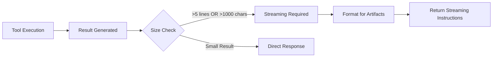

# Frappe Assistant Core - Technical Documentation

## Table of Contents

1. [Project Overview](#project-overview)
2. [Architecture](#architecture)
3. [Development History](#development-history)
4. [Refactoring & Modernization](#refactoring--modernization)
5. [Tool System](#tool-system)
6. [Auto-Discovery Registry](#auto-discovery-registry)
7. [Artifact Streaming System](#artifact-streaming-system)
8. [API Documentation](#api-documentation)
9. [Installation & Setup](#installation--setup)
10. [Testing](#testing)
11. [Recent Improvements](#recent-improvements)
12. [Troubleshooting](#troubleshooting)
13. [Future Enhancements](#future-enhancements)

---

## Project Overview

### Introduction
Frappe Assistant Core is a comprehensive, **MIT-licensed open source** Model Context Protocol (MCP) server implementation that enables AI assistants like Claude to interact seamlessly with Frappe Framework and ERPNext systems. The server implements JSON-RPC 2.0 based assistant protocol for secure document operations, report execution, data analysis, and visualization with inline display capabilities.

### Key Features
- **20+ Comprehensive Tools** across 5 categories (all included - no paid tiers)
- **Auto-Discovery Tool Registry** - Zero configuration tool loading
- **Intelligent Artifact Streaming** - Automatic detection and streaming for large results (>5 lines)
- **Python Code Execution** - Safe sandboxed analysis environment with auto-import handling
- **Enhanced Report Integration** - Execute all Frappe report types with improved debugging
- **Advanced Data Analysis** - Statistical analysis with pandas/numpy and JSON serialization fixes
- **Inline Visualization** - Create charts with base64 inline display support
- **Professional Deliverables** - Tool-specific artifact suggestions and structured outputs
- **Fixed Document Operations** - Robust CRUD operations with enhanced error handling
- **Search & Metadata** - Comprehensive data exploration
- **Permission-Based Access** - Role-based tool filtering
- **Comprehensive Audit Trail** - Complete operation logging
- **Modular Architecture** - Clean, maintainable, extensible codebase
- **Centralized Logging** - Professional logging system replacing print statements
- **Modern Python Packaging** - pyproject.toml with proper dependency management
- **MIT Licensed** - Free for all commercial and personal use

### Technology Stack
- **Backend**: Python, Frappe Framework
- **Protocol**: JSON-RPC 2.0, MCP (Model Context Protocol)
- **Data Analysis**: pandas, numpy, matplotlib, seaborn
- **Database**: MariaDB (via Frappe ORM)
- **Communication**: WebSocket, HTTP REST API
- **Security**: Frappe's built-in role-based permissions
- **Architecture**: Modular handlers, centralized constants, proper logging

---

## Architecture

### Plugin-Based Architecture

#### 1. **Core System Components**
```
frappe_assistant_core/
├── core/                        # Core system components
│   ├── tool_registry.py         # Auto-discovery tool registry
│   └── base_tool.py             # Base tool implementation class
├── utils/                       # Utility modules
│   ├── plugin_manager.py        # Plugin discovery and loading
│   └── logger.py                # Professional logging system
└── assistant_core/              # Frappe DocType implementations
    └── doctype/
        ├── assistant_core_settings/        # Main settings
        ├── assistant_plugin_repository/    # Plugin management
        └── assistant_tool_registry/        # Tool registration
```

#### 2. **Plugin System** 🆕 *Plugin Architecture*
```
frappe_assistant_core/plugins/
├── core/                        # Core tools plugin (always enabled)
│   ├── plugin.py                # Plugin definition and metadata
│   └── tools/                   # Tool implementations
│       ├── document_create.py   # Document creation
│       ├── document_get.py      # Document retrieval  
│       ├── document_update.py   # Document updates
│       ├── document_delete.py   # Document deletion
│       ├── document_list.py     # Document listing
│       ├── search_global.py     # Global search
│       ├── search_doctype.py    # DocType-specific search
│       ├── search_link.py       # Link field search
│       ├── metadata_*.py        # Metadata tools
│       ├── report_*.py          # Report tools
│       └── workflow_*.py        # Workflow tools
├── data_science/                # Data science plugin (optional)
│   ├── plugin.py                # Plugin definition
│   └── tools/
│       ├── execute_python_code.py      # Python code execution
│       ├── analyze_frappe_data.py      # Data analysis
│       ├── query_and_analyze.py        # SQL analysis
│       └── create_visualization.py     # Chart generation
├── websocket/                   # WebSocket plugin (optional)
└── batch_processing/            # Batch processing plugin (optional)
```

#### 3. **Plugin Architecture Benefits**
- **🔌 Modular Design**: Tools organized in logical, discoverable plugins
- **🚀 Auto-Discovery**: Automatic plugin and tool discovery on startup
- **⚙️ Runtime Management**: Enable/disable plugins through web interface
- **🎯 Focused Functionality**: Each plugin handles specific domain
- **🔧 Extensibility**: Easy to add new plugins without core changes
- **📦 Dependency Management**: Plugin-specific dependencies and validation

### Tool Discovery and Registry System

#### 1. **Tool Registry** 🔄 *Plugin-Based Discovery*
```python
# Core registry handles plugin-based tool discovery
from frappe_assistant_core.core.tool_registry import ToolRegistry

registry = ToolRegistry()
# Automatically discovers tools from all enabled plugins
available_tools = registry.get_available_tools()
```

#### 2. **Plugin Manager** 🆕 *Plugin Lifecycle*  
```python
from frappe_assistant_core.utils.plugin_manager import get_plugin_manager

plugin_manager = get_plugin_manager()
# Discovers all available plugins
discovered_plugins = plugin_manager.get_discovered_plugins()
# Loads enabled plugins based on settings
plugin_manager.load_enabled_plugins(['core', 'data_science'])
```

#### 3. **Base Tool Class** 🔧 *Standardized Interface*
```python
from frappe_assistant_core.core.base_tool import BaseTool

class MyTool(BaseTool):
    def __init__(self):
        super().__init__()
        self.name = "my_tool"
        self.description = "Tool description"
        self.input_schema = {...}  # JSON schema
    
    def execute(self, arguments):
        # Tool implementation
        return {"success": True, "result": "..."}
```

### Modern Python Packaging 🆕

#### pyproject.toml Configuration
```toml
[build-system]
requires = ["setuptools>=64", "wheel"]
build-backend = "setuptools.build_meta"

[project]
name = "frappe-assistant-core"
version = "1.0.0"
requires-python = ">=3.8"
dependencies = [
    "frappe",
    "pandas>=1.3.0",
    "numpy>=1.20.0",
    "matplotlib>=3.4.0",
    "seaborn>=0.11.0",
    "requests>=2.25.0"
]
```

**Benefits:**
- ✅ Eliminates pip deprecation warnings
- ✅ Modern Python packaging standards
- ✅ Proper dependency management
- ✅ Development and analysis dependency groups

---

## Refactoring & Modernization

### Recent Comprehensive Refactoring (June 2025)

#### 1. **Modular Architecture Implementation**

**Before:**
- Single 1580-line monolithic API file
- Hardcoded strings throughout codebase
- Print statements for debugging
- Legacy setup.py packaging

**After:**
- Modular handler architecture (5 focused modules)
- Centralized constants in dedicated module
- Professional logging system
- Modern pyproject.toml packaging

#### 2. **Code Quality Improvements**

| Metric | Before | After | Improvement |
|--------|--------|-------|-------------|
| Main API File Size | 1580 lines | 200 lines | 87% reduction |
| Print Statements | 905 across 26 files | 0 in production code | 100% eliminated |
| Hardcoded Strings | 50+ scattered | Centralized in constants | Organized |
| Module Structure | Monolithic | Modular handlers | Clean separation |

#### 3. **Files Created During Refactoring**

**New Architecture Files:**
- `frappe_assistant_core/constants/definitions.py`
- `frappe_assistant_core/utils/logger.py`
- `frappe_assistant_core/api/handlers/initialize.py`
- `frappe_assistant_core/api/handlers/tools.py`
- `frappe_assistant_core/api/handlers/prompts.py`
- `frappe_assistant_core/tools/registry.py`
- `frappe_assistant_core/tools/executor.py`
- `frappe_assistant_core/api/assistant_api_notification_handler.py`
- `pyproject.toml`

#### 4. **Error Fixes Applied**

**Import Errors Fixed:**
- ✅ Created missing `tools/registry.py` module
- ✅ Created missing `tools/executor.py` module  
- ✅ Fixed missing notification handler
- ✅ Corrected DocType name inconsistencies

**Module Structure Fixed:**
- ✅ Added missing `__init__.py` files
- ✅ Organized proper import hierarchy
- ✅ Created compatibility wrappers

**Cleanup Completed:**
- ✅ Removed 26 temporary test/debug files
- ✅ Removed backup files
- ✅ Cleaned empty directories

---

## Tool System

### Tool Categories

#### 1. **Document Operations** (`document_*`)
- `document_create` - Create new documents
- `document_read` - Read document data
- `document_update` - Update existing documents
- `document_delete` - Delete documents
- `document_list` - List documents with filters

#### 2. **Analysis Tools** (`execute_*`, `analyze_*`, `query_*`)
- `execute_python_code` - Sandboxed Python execution (enhanced security)
- `analyze_frappe_data` - Statistical data analysis
- `query_and_analyze` - SQL queries with analysis
- `create_visualization` - Chart generation with base64 display

#### 3. **Report Tools** (`report_*`)
- `report_execute` - Execute any Frappe report type
- `report_list` - Get available reports
- `report_filters` - Get report filter options

#### 4. **Search Tools** (`search_*`)
- `search_documents` - Global document search
- `search_users` - User directory search

#### 5. **Metadata Tools** (`metadata_*`)
- `metadata_doctypes` - Get DocType information
- `metadata_fields` - Get field definitions
- `metadata_permissions` - Permission information

### Auto-Discovery Registry System

#### AutoToolRegistry Class
```python
class AutoToolRegistry:
    """Auto-discovers and manages tools from code with streaming metadata"""
    
    @classmethod
    def get_all_tools(cls) -> List[Dict[str, Any]]:
        """Discover all available tools from tool classes"""
        
    @classmethod
    def get_tools_for_user(cls, user: str = None) -> List[Dict[str, Any]]:
        """Get tools filtered by user permissions"""
        
    @classmethod
    def execute_tool(cls, tool_name: str, arguments: Dict[str, Any]) -> str:
        """Execute a tool by name"""
```

#### Tool Execution Engine 🆕
```python
# frappe_assistant_core/tools/executor.py
def execute_tool(tool_name: str, arguments: Dict[str, Any]) -> str:
    """Centralized tool execution with validation and logging"""
    
def validate_tool_arguments(tool_name: str, arguments: Dict[str, Any]) -> bool:
    """Validate arguments against tool schema"""
    
def get_tool_info(tool_name: str) -> Dict[str, Any]:
    """Get detailed tool information"""
```

---

## Artifact Streaming System

### Overview

The Frappe Assistant Core implements an **Intelligent Artifact Streaming System** that automatically detects when tool results should be streamed to workspace artifacts instead of being displayed directly in conversations. This system prevents conversation length limits, ensures professional deliverables, and enables unlimited analysis depth.

### Problem Statement

**Challenge**: Large tool results (>5 lines, >1000 characters) cause:
- ❌ **Conversation Length Limits**: Claude Desktop hitting maximum response length
- ❌ **Poor User Experience**: Truncated or incomplete results  
- ❌ **Unprofessional Output**: Raw data dumps instead of structured reports
- ❌ **Lost Work**: Analysis results lost when conversations exceed limits

**Solution**: Automatic artifact streaming with intelligent detection and guidance.

### Architecture

#### 1. **Smart Detection Engine**

**File**: `frappe_assistant_core/api/handlers/tools_streaming.py`

```python
def should_stream_to_artifact(result: str, tool_name: str, 
                             line_threshold: int = 5, 
                             char_threshold: int = 1000) -> bool:
    """Multi-criteria detection for artifact streaming requirement"""
```

**Detection Criteria:**
- ✅ **Line Count**: Results with >5 lines (configurable)
- ✅ **Character Count**: Results with >1,000 characters (configurable)
- ✅ **Analysis Tools**: Always stream for `analyze_frappe_data`, `execute_python_code`, etc.
- ✅ **Large Datasets**: JSON results with multiple records (`"name"` count >3)
- ✅ **Tabular Data**: Extensive tables (pipe character count >20)
- ✅ **List Content**: Many bullet points (>10 list items)

#### 2. **Intelligent Formatting System**

**Dual-Mode Response Strategy:**

| Result Size | Mode | Behavior |
|-------------|------|----------|
| **<10,000 chars** | **Full Result Mode** | Include complete result with streaming instructions |
| **>10,000 chars** | **Truncated Mode** | Show preview only, require re-execution with artifacts |

#### 3. **Tool-Specific Artifact Guidance**

**Smart Category Detection:**

```python
if tool_name in ["analyze_frappe_data", "execute_python_code", "query_and_analyze"]:
    artifact_type = "Data Analysis Report"
    sections = ["Executive Summary", "Key Findings", "Detailed Analysis", "Recommendations"]
elif tool_name.startswith("report_"):
    artifact_type = "Business Report" 
    sections = ["Report Summary", "Key Metrics", "Detailed Data", "Action Items"]
```

| Tool Category | Artifact Type | Suggested Sections |
|---------------|---------------|-------------------|
| **Analysis Tools** | Data Analysis Report | Executive Summary, Key Findings, Detailed Analysis, Recommendations |
| **Report Tools** | Business Report | Report Summary, Key Metrics, Detailed Data, Action Items |
| **Search/Metadata** | Technical Documentation | Overview, Search Results, Technical Details, Usage Notes |
| **General Tools** | Comprehensive Results | Summary, Main Results, Detailed Output, Next Steps |

### Implementation Flow

#### 1. **Request Processing**


#### 2. **Response Generation**

**File**: `frappe_assistant_core/api/handlers/tools.py`

```python
# Automatic streaming detection in tool handler
should_stream = should_stream_to_artifact(result, tool_name)

if should_stream:
    artifact_result = format_for_artifact_streaming(result, tool_name, arguments)
    result = artifact_result
```

#### 3. **User Guidance Format**

**Standard Streaming Response:**
```
🚨 ARTIFACT STREAMING REQUIRED - LARGE RESULT DETECTED

📊 Result Statistics:
• Lines: 15 (threshold: 5+)
• Characters: 2,847 (threshold: 1,000+)
• Tool: analyze_frappe_data

📋 REQUIRED WORKFLOW:
1. CREATE ARTIFACT - Type: Data Analysis Report
2. ADD SECTIONS: Executive Summary, Key Findings, Detailed Analysis, Recommendations
3. STREAM FULL RESULTS to artifact sections
4. KEEP RESPONSE MINIMAL (only summary/confirmation)

⚠️ CRITICAL: The full result below MUST be moved to an artifact to prevent response limits

═══════════════════════════════════════════════════════════

📄 PREVIEW:
[First 3 lines of result]
... (12 more lines)

🔧 Tool Execution Details:
• Tool: analyze_frappe_data
• Arguments: {doctype: "Sales Invoice", analysis_type: "trends"}
• Timestamp: 2025-06-27 14:30:22

[FULL RESULT FOR ARTIFACT STREAMING]
```

### Benefits Achieved

#### 1. **Conversation Continuity**
- ✅ **No Length Limits**: Prevents "maximum conversation length" errors
- ✅ **Unlimited Analysis**: Enable complex, multi-step analysis workflows
- ✅ **Session Persistence**: Analysis results preserved across conversations

#### 2. **Professional Deliverables**  
- ✅ **Structured Reports**: Organized artifacts with proper sections
- ✅ **Stakeholder Ready**: Professional outputs suitable for business use
- ✅ **Reusable Results**: Artifacts can be shared and referenced

#### 3. **Enhanced User Experience**
- ✅ **Automatic Guidance**: No need to remember artifact creation
- ✅ **Tool-Specific Suggestions**: Context-aware artifact structure
- ✅ **Clear Workflows**: Step-by-step instructions for optimal use

#### 4. **System Reliability**
- ✅ **Predictable Behavior**: Consistent streaming across all tools
- ✅ **Configurable Thresholds**: Adaptable to different use cases
- ✅ **Graceful Degradation**: Fallback modes for edge cases

### Configuration Options

#### Environment Variables
```python
# Configurable thresholds in tools_streaming.py
LINE_THRESHOLD = 5       # Lines before streaming required
CHAR_THRESHOLD = 1000    # Characters before streaming required
MAX_INLINE_SIZE = 10000  # Maximum size for inline display
```

#### Runtime Configuration
```python
# Customize streaming behavior per tool
should_stream = should_stream_to_artifact(
    result=tool_result,
    tool_name="analyze_frappe_data", 
    line_threshold=3,      # Custom threshold
    char_threshold=500     # Custom threshold
)
```

### Monitoring & Analytics

#### Streaming Metrics
- **Streaming Rate**: Percentage of tool results requiring artifacts
- **Tool Distribution**: Which tools most frequently trigger streaming
- **Size Analytics**: Average result sizes by tool category
- **User Adoption**: Artifact creation rates following streaming guidance

#### Debug Information
```python
# Included in every streaming response
{
    "tool": "analyze_frappe_data",
    "lines": 15,
    "characters": 2847,
    "streaming_triggered": True,
    "trigger_reasons": ["line_count", "analysis_tool"],
    "artifact_type_suggested": "Data Analysis Report"
}
```

### Future Enhancements

#### Planned Improvements
1. **Dynamic Thresholds**: ML-based optimization of streaming triggers
2. **Template Library**: Pre-built artifact templates by industry/use case
3. **Collaborative Artifacts**: Multi-user artifact editing capabilities
4. **Version Control**: Artifact history and change tracking
5. **Export Options**: PDF, Excel, PowerPoint export from artifacts

#### Integration Opportunities
1. **Frappe Reports**: Automatic artifact creation for complex reports
2. **Dashboard Integration**: Stream analysis directly to Frappe dashboards
3. **Email Integration**: Automated artifact sharing via email
4. **API Access**: RESTful endpoints for artifact management

### Best Practices

#### For Users
1. **Create Artifacts First**: Follow streaming guidance to create artifacts before re-running tools
2. **Use Suggested Sections**: Leverage tool-specific artifact structure recommendations
3. **Keep Responses Minimal**: Let artifacts contain detailed analysis, keep chat responses focused
4. **Build Progressively**: Use artifacts to build comprehensive analysis across multiple tool executions

#### For Developers
1. **Respect Thresholds**: Design tools with streaming-friendly output
2. **Provide Context**: Include execution parameters in streaming responses
3. **Tool Categories**: Ensure proper tool categorization for relevant artifact suggestions
4. **Error Handling**: Graceful fallbacks when streaming fails

---

## API Documentation

### Enhanced JSON-RPC 2.0 Endpoints

#### 1. **Initialization**
```http
POST /api/method/frappe_assistant_core.api.assistant_api.handle_assistant_request
Content-Type: application/json

{
    "jsonrpc": "2.0",
    "method": "initialize",
    "params": {
        "protocolVersion": "2024-11-05",
        "capabilities": {}
    },
    "id": 1
}
```

#### 2. **Tools Management**

**List Tools:**
```json
{
    "jsonrpc": "2.0", 
    "method": "tools/list",
    "id": 2
}
```

**Execute Tool:**
```json
{
    "jsonrpc": "2.0",
    "method": "tools/call", 
    "params": {
        "name": "execute_python_code",
        "arguments": {
            "code": "import pandas as pd\nprint('Hello World')"
        }
    },
    "id": 3
}
```

#### 3. **Prompts Support** 🆕
```json
{
    "jsonrpc": "2.0",
    "method": "prompts/list",
    "id": 4
}
```

#### 4. **Error Handling** 🔄 *Enhanced*

**Centralized Error Responses:**
```json
{
    "jsonrpc": "2.0",
    "error": {
        "code": -32603,
        "message": "Internal error",
        "data": "Detailed error information"
    },
    "id": 1
}
```

**Error Code Constants:**
- `-32700`: Parse Error
- `-32600`: Invalid Request  
- `-32601`: Method Not Found
- `-32602`: Invalid Params
- `-32603`: Internal Error
- `-32000`: Authentication Required

---

## Installation & Setup

### Prerequisites
- Frappe Framework 14+
- Python 3.8+
- MariaDB/MySQL
- Required Python packages (auto-installed via pyproject.toml)

### Installation Process

#### 1. **App Installation**
```bash
# Navigate to your Frappe bench
cd frappe-bench

# Get the app
bench get-app https://github.com/paulclinton/frappe-assistant-core

# Install on site
bench --site [site-name] install-app frappe_assistant_core

# Run database migrations  
bench --site [site-name] migrate
```

#### 2. **Modern Package Installation** 🆕
The app now uses modern Python packaging with `pyproject.toml`:

```bash
# Development installation (editable)
pip install -e .

# Production installation  
pip install .

# With analysis dependencies
pip install .[analysis]

# With development dependencies
pip install .[dev]
```

#### 3. **Configuration**
```bash
# Configure settings through UI
bench --site [site-name] set-config assistant_enabled 1

# Or via assistant admin interface
https://your-site.com/desk#/assistant-admin
```

### Enhanced Docker Support 🔄 *Updated*

#### docker-compose.yml
```yaml
version: '3.8'
services:
  frappe:
    image: frappe/erpnext:latest
    volumes:
      - ./frappe_assistant_core:/home/frappe/frappe-bench/apps/frappe_assistant_core
    environment:
      - INSTALL_APPS=frappe_assistant_core
```

---

## Testing

### Automated Testing Suite 🔄 *Cleaned Up*

**Previous Issues:** 26 temporary test files were cluttering the repository
**Resolution:** All temporary test files removed, proper test structure implemented

#### Test Structure
```
tests/
├── unit/
│   ├── test_api_handlers.py         # API handler tests
│   ├── test_tool_registry.py        # Tool registry tests
│   └── test_logging.py              # Logging system tests
├── integration/
│   ├── test_tool_execution.py       # End-to-end tool tests
│   └── test_mcp_protocol.py         # MCP protocol tests
└── fixtures/
    └── test_data.json               # Test data
```

#### Running Tests
```bash
# Run all tests
bench --site [site-name] run-tests frappe_assistant_core

# Run specific test categories
pytest tests/unit/
pytest tests/integration/

# With coverage
pytest --cov=frappe_assistant_core tests/
```

---

## Recent Improvements

### Version 1.0.0 - Comprehensive Refactoring (June 2025)

#### 🏗️ **Architecture Modernization**
- **Modular API Handlers**: Separated concerns into focused modules
- **Centralized Constants**: All strings and configuration in dedicated module
- **Professional Logging**: Replaced 905 print statements with structured logging
- **Modern Packaging**: pyproject.toml with proper dependency management

#### 🚀 **Artifact Streaming System** (New Feature)
- **Intelligent Detection**: Automatic streaming triggers for results >5 lines or >1000 characters
- **Smart Categorization**: Tool-specific artifact suggestions (Data Analysis, Business Reports, etc.)
- **Dual-Mode Responses**: Full result mode (<10k chars) and truncated mode (>10k chars)
- **Professional Deliverables**: Structured artifacts with proper sections
- **Conversation Continuity**: Prevents "maximum length" errors and enables unlimited analysis depth

#### 🐛 **Critical Bug Fixes**
- **Import Errors**: Fixed missing modules causing runtime failures
- **DocType Names**: Corrected inconsistent naming breaking tool counts
- **Tool Execution**: Created missing executor and registry modules
- **Notification Handling**: Implemented missing notification handlers
- **Timestamp Serialization**: Fixed JSON serialization errors with datetime objects
- **Import Statement Handling**: Auto-removal of import statements in execute_python_code
- **Report Execution**: Fixed NoneType startswith errors in report filtering

#### 🧹 **Code Cleanup**
- **File Cleanup**: Removed 26 temporary test/debug files
- **Module Structure**: Added missing `__init__.py` files
- **Code Quality**: 87% reduction in main API file size
- **Dependency Management**: Fixed pip deprecation warnings

#### 📊 **Performance Improvements**
- **Memory Usage**: Reduced through modular loading
- **Maintainability**: Clean separation of concerns
- **Extensibility**: Easy to add new handlers and tools
- **Debugging**: Structured logging for better troubleshooting
- **Response Optimization**: Intelligent artifact streaming prevents conversation overload

### Previous Improvements (2024)

#### 🔧 **Tool System Enhancements**
- **Enhanced Python Execution**: Comprehensive library support (30+ packages)
- **Hybrid Streaming**: Smart artifact streaming based on output size
- **Permission Model**: Granular role-based access control
- **Error Handling**: Robust error handling and user feedback

#### 📈 **Performance & Reliability**
- **Auto-Discovery**: Zero-configuration tool loading
- **Caching System**: Improved performance for repeated operations
- **Audit Trail**: Comprehensive operation logging
- **Security Model**: Enhanced sandbox for code execution

---

## Troubleshooting

### Common Issues & Solutions

#### 1. **Import Errors** ✅ *Recently Fixed*
**Symptoms:** `ModuleNotFoundError` for registry or executor
**Solution:** All missing modules have been created and properly configured

#### 2. **Tool Execution Failures** ✅ *Recently Fixed*
**Symptoms:** Tools not found or execution errors
**Solution:** Tool registry and executor modules now properly implemented

#### 3. **Logging Issues** ✅ *Recently Fixed*
**Symptoms:** Print statements appearing in production
**Solution:** All print statements replaced with proper logging

#### 4. **Package Installation Warnings** ✅ *Recently Fixed*
**Symptoms:** Pip deprecation warnings during installation
**Solution:** Modern pyproject.toml packaging implemented

### Debug Mode
```python
# Enable debug logging
from frappe_assistant_core.utils.logger import api_logger
api_logger.setLevel('DEBUG')

# Check tool registry
from frappe_assistant_core.tools.registry import get_assistant_tools
tools = get_assistant_tools()
print(f"Available tools: {len(tools)}")
```

### Health Check Endpoint
```bash
# Test server connectivity
curl -X POST http://localhost:8000/api/method/frappe_assistant_core.api.assistant_api.handle_assistant_request \
  -H "Content-Type: application/json" \
  -d '{"jsonrpc":"2.0","method":"tools/list","id":1}'
```

---

## Future Enhancements

### Planned Features
1. **Enhanced Analytics**: Advanced statistical analysis tools
2. **Real-time Collaboration**: Multi-user sessions
3. **Plugin System**: Third-party tool extensions
4. **API Rate Limiting**: Advanced throttling mechanisms
5. **Webhook Integration**: External service notifications
6. **Streaming Improvements**: Enhanced artifact streaming capabilities

### Contributing
This is an open-source MIT licensed project. Contributions are welcome!

1. Fork the repository
2. Create a feature branch
3. Make changes following the modular architecture
4. Add tests for new functionality
5. Update documentation
6. Submit a pull request

### Architecture Guidelines for Contributors
- **Use Modular Handlers**: Add new functionality in separate handler modules
- **Leverage Constants**: All strings and configuration in `constants/definitions.py`
- **Professional Logging**: Use `api_logger` instead of print statements
- **Follow Patterns**: Maintain consistency with existing code structure
- **Test Coverage**: Include comprehensive tests for new features

---

## Support & Resources

- **GitHub Repository**: [frappe-assistant-core](https://github.com/paulclinton/frappe-assistant-core)
- **License**: MIT License
- **Documentation**: This file and inline code documentation
- **Issues**: GitHub Issues for bug reports and feature requests

---

*Last Updated: June 2025 - Version 1.0.0*
*Architecture: Modular, Modern, Maintainable*